# DriveOS — Product Requirements Document

> **Status:** Draft — Dikonfirmasi bersama stakeholder pada 23 Juli 2026
> **Versi:** 1.0
> **Dokumen ini menggantikan seluruh brief sebelumnya ("AutoVista")** — DriveOS adalah *single source of truth* untuk tim Product, UI/UX, Frontend, Backend, dan QA.

---

## Daftar Isi

1. Executive Summary
2. Business Background
3. Problem Statement
4. Product Vision
5. Business Goals
6. Product Goals
7. Success Metrics (KPI)
8. Scope
9. Stakeholders
10. User Personas
11. User Journeys
12. Epics & User Stories
13. Feature Breakdown
14. Functional Requirements
15. Non-Functional Requirements
16. Business Rules
17. Validation Rules
18. Edge Cases & Error Handling
19. Information Architecture (Sitemap & Navigasi)
20. Dashboard Layout Specification & UX per Halaman
21. Apple Design System Specification
22. Component Specification
23. State Handling (Loading, Empty, Error, Success)
24. Responsive Behavior
25. API Requirements
26. Database Design (ERD & Skema)
27. System Architecture
28. Sequence Diagrams
29. Activity Diagrams
30. State Diagrams
31. Permission Matrix
32. Security Requirements
33. Logging Strategy
34. Notification Flow
35. Integration Requirements
36. AI Features Recommendation
37. Analytics & Event Tracking Plan
38. Accessibility (WCAG 2.2)
39. Performance Requirements
40. Technical Constraints
41. QA Strategy
42. Risk Analysis
43. Release Plan
44. Future Roadmap
45. Glossary
- Appendix A: Recommended Tech Stack Tambahan
- Appendix B: Assumptions Log

---

## 1. Executive Summary

**DriveOS** adalah Automotive Intelligence Dashboard berbasis web yang menyatukan seluruh aktivitas bisnis otomotif — penjualan, inventori, servis, fleet, financial, dan intelijen pelanggan — dalam satu platform premium yang terasa seperti produk Apple: minimalis, content-first, penuh white space, namun tetap membawa jiwa premium otomotif (BMW, Lamborghini, Porsche, Mercedes-Benz, Audi, Ferrari, Tesla) melalui tipografi tegas, material glassmorphism, dan micro-interaction halus.

DriveOS ditujukan untuk dealer premium, showroom, fleet manager, dan perusahaan rental yang selama ini mengelola data penjualan, inventori, dan servis secara terpisah (spreadsheet, sistem legacy, atau tools yang tidak saling terhubung). DriveOS menyatukan semuanya dalam satu **Executive Overview Dashboard** yang didukung **AI Insight Panel** dan **AI Assistant** berbasis LLM untuk membantu pengambilan keputusan berbasis data secara real-time.

Dokumen ini mencakup keseluruhan requirement — dari business rules, data model, API, hingga design system Apple HIG — sehingga tim Product, UI/UX, Frontend, Backend, dan QA dapat langsung mengeksekusi tanpa membutuhkan dokumentasi tambahan.

## 2. Business Background

Industri otomotif premium di Indonesia (dan pasar sejenis) menghadapi tantangan operasional berikut:

- Data penjualan, inventori, dan servis tersebar di sistem/spreadsheet berbeda, sehingga *executive* tidak punya visibilitas real-time terhadap kinerja bisnis.
- Proses approval diskon dan deal masih manual (WhatsApp, email), rawan human error dan lambat.
- Dealer & showroom premium menuntut pengalaman digital internal yang setara dengan pengalaman produk yang mereka jual — premium, cepat, elegan.
- Fleet manager dan perusahaan rental kesulitan memonitor utilisasi kendaraan secara real-time, menyebabkan idle asset dan kehilangan revenue.
- Belum ada alat bantu berbasis AI yang menerjemahkan data mentah menjadi insight actionable bagi *non-technical stakeholder* (Dealer Owner, Executive Manager).

DriveOS hadir sebagai jawaban: satu platform terpadu, premium secara visual, dan cerdas secara analitik.

## 3. Problem Statement

> Dealer premium, showroom, fleet manager, dan perusahaan rental tidak memiliki satu platform terpadu yang menampilkan kondisi bisnis mereka (penjualan, inventori, servis, fleet, finansial) secara real-time, premium secara pengalaman, dan cerdas secara analitik — sehingga pengambilan keputusan menjadi lambat, reaktif, dan bergantung pada laporan manual yang usang saat dibaca.

## 4. Product Vision

> **"DriveOS menjadi pusat kendali cerdas bagi bisnis otomotif premium — di mana setiap keputusan, dari lantai showroom hingga ruang rapat eksekutif, didukung oleh data real-time dan kecerdasan buatan, dibungkus dalam pengalaman visual sekelas produk yang mereka jual."**

DriveOS dirancang agar terasa **content-first**, **minimalis**, dan **premium** — mengikuti Apple Human Interface Guidelines — namun tetap membawa DNA visual otomotif mewah melalui showcase kendaraan 360°, tipografi tegas, dan motion yang halus.

## 5. Business Goals

| # | Business Goal |
|---|---|
| BG-01 | Meningkatkan kecepatan pengambilan keputusan eksekutif melalui visibilitas data real-time terpadu |
| BG-02 | Meningkatkan konversi sales funnel melalui insight AI dan monitoring pipeline yang lebih baik |
| BG-03 | Mengurangi idle asset (kendaraan tidak terpakai) pada operasional fleet & rental |
| BG-04 | Meningkatkan retensi pelanggan melalui customer analytics dan pengingat servis otomatis |
| BG-05 | Menjadikan DriveOS produk SaaS yang dapat dijual ke banyak dealer/perusahaan otomotif (multi-tenant) sebagai lini bisnis baru |
| BG-06 | Membangun diferensiasi kompetitif melalui pengalaman UI/UX premium yang belum ada di kategori dashboard otomotif |

## 6. Product Goals

| # | Product Goal |
|---|---|
| PG-01 | Menyediakan Executive Overview Dashboard yang menampilkan seluruh KPI bisnis dalam satu layar tanpa scroll berlebihan |
| PG-02 | Menyediakan showcase kendaraan premium (360° viewer) yang setara pengalaman digital brand otomotif mewah |
| PG-03 | Menyediakan AI Insight Panel & AI Assistant yang mampu menjawab pertanyaan bisnis dalam bahasa natural |
| PG-04 | Menyediakan monitoring fleet & live delivery tracking real-time |
| PG-05 | Menyediakan Report Center dengan export PDF/Excel/CSV yang dapat dijadwalkan |
| PG-06 | Menerapkan Apple Design System (8pt grid, SF Pro, rounded 24px, dark & light mode) secara konsisten di seluruh halaman |
| PG-07 | Menjamin akses berbasis peran (RBAC) yang granular untuk 10 jenis role pengguna |

## 7. Success Metrics (KPI)

| KPI | Baseline (Asumsi) | Target 6 Bulan Pasca-Launch | Cara Ukur |
|---|---|---|---|
| Waktu rata-rata executive membuka laporan harian | 15–20 menit (manual) | ≤ 2 menit (buka dashboard) | Analytics: time-to-first-meaningful-render + event tracking |
| Tingkat adopsi harian (DAU/MAU) | — | ≥ 60% | Event tracking login harian |
| Peningkatan konversi sales funnel (lead → closed won) | Baseline internal tenant | +10–15% dalam 6 bulan | Perbandingan data Sales Funnel sebelum/sesudah |
| Pengurangan idle fleet vehicle | Baseline internal tenant | -20% idle time | Data Fleet Monitoring |
| Waktu approval deal (submit → keputusan) | 1–2 hari (manual) | ≤ 4 jam | Timestamp `sales_order` audit log |
| Adopsi AI Assistant (query per user aktif/minggu) | — | ≥ 3 query/user/minggu | Event tracking AI Assistant |
| Skor kepuasan pengguna (in-app survey) | — | ≥ 4.2 / 5 | In-app CSAT survey kuartalan |
| Ketersediaan sistem (uptime) | — | ≥ 99.9% | Monitoring infrastruktur |

## 8. Scope

### 8.1 In Scope (MVP – Rilis 1.0)

- 18 fitur utama sesuai brief: Executive Overview, Sales Intelligence, Vehicle Inventory Management, Premium Vehicle Gallery, Vehicle Detail 360°, Customer Analytics, Fleet Monitoring, Service Management, Financial Dashboard, Brand Performance Comparison, AI Insight Panel, Live Delivery Tracking, Activity Timeline, Notification Center, AI Assistant, Smart Search, Report Center, User & Role Management.
- Fondasi platform: Authentication & Security, Tenant & Branch Management (multi-tenant), Apple Design System (dark/light mode), Responsive web (desktop, tablet, mobile browser).
- Integrasi: Payment Gateway, Google Maps, WhatsApp Business API, Email transaksional, LLM API (Claude) untuk AI Insight & AI Assistant.

### 8.2 Out of Scope (Fase Berikutnya)

- Aplikasi mobile native (iOS/Android) — *Assumption: web responsive dulu, native app masuk roadmap.*
- Integrasi GPS/telematics hardware real-time pada kendaraan fisik — live tracking tahap MVP berbasis update manual/berkala.
- Integrasi ERP/CRM eksternal pihak ketiga.
- Marketplace antar-dealer (transfer stok lintas tenant).
- Dynamic pricing engine otomatis.
- White-label/branding kustom penuh per tenant (tahap MVP hanya logo & warna aksen).

## 9. Stakeholders

| Stakeholder | Kepentingan |
|---|---|
| Dealer Owner | ROI bisnis, visibilitas performa, keputusan strategis |
| Executive Manager | Operasional harian lintas cabang |
| Product Team (Internal DriveOS) | Roadmap, prioritas fitur, adopsi produk |
| Engineering Team | Kelayakan teknis, arsitektur, maintainability |
| UI/UX Team | Konsistensi design system, usability |
| QA Team | Kualitas rilis, regression |
| Compliance/Legal (Assumption) | Kepatuhan UU PDP, keamanan data pelanggan |
| Tenant End-Users (8 role operasional) | Efisiensi kerja harian |

---

## 10. User Personas

### 10.1 Ringkasan Role

| Role ID | Nama Role | Level | Kategori |
|---|---|---|---|
| `SUPER_ADMIN` | Platform Super Admin | Platform (Internal DriveOS) | *Assumption — dibutuhkan untuk operasional SaaS multi-tenant* |
| `DEALER_OWNER` | Dealer Owner | Tenant (Pemilik Bisnis) | Eksekutif |
| `EXEC_MANAGER` | Executive Manager | Tenant/Branch | Eksekutif Operasional |
| `SALES_CONSULTANT` | Sales Consultant | Branch | Operasional |
| `INVENTORY_MANAGER` | Inventory Manager | Branch/Tenant | Operasional |
| `SERVICE_ADVISOR` | Service Advisor | Branch | Operasional |
| `FLEET_MANAGER` | Fleet Manager | Tenant/Branch | Operasional |
| `FINANCE_TEAM` | Finance Team | Tenant | Operasional |
| `MARKETING_TEAM` | Marketing Team | Tenant | Operasional |
| `SYSTEM_ADMIN` | System Administrator | Tenant | *Assumption — pengelola user, role, dan konfigurasi tenant* |

### 10.2 Detail Persona

**1) Dealer Owner** — *"Saya ingin tahu kondisi bisnis saya dalam 10 detik, bukan 10 halaman laporan."*
- **Goals:** Melihat performa penjualan, profit, dan kepuasan pelanggan lintas cabang secara instan; mengambil keputusan strategis (ekspansi, diskon besar, brand focus).
- **Pain Points:** Laporan manual terlambat; tidak ada visibilitas real-time; sulit membandingkan performa antar cabang/brand.
- **Fitur Utama:** Executive Overview Dashboard, Financial Dashboard, Brand Performance Comparison, AI Insight Panel, AI Assistant.
- **Device:** Desktop (kantor) & tablet/mobile browser (saat mobile).
- **Tech-savviness:** Menengah — butuh UI sangat sederhana, minim jargon teknis.

**2) Executive Manager** — *"Saya menjalankan operasional harian cabang dan butuh tahu apa yang butuh perhatian saya hari ini."*
- **Goals:** Memantau operasional cabang harian, menyetujui approval dalam ambang tertentu, mengelola tim.
- **Pain Points:** Approval terjebak di banyak channel komunikasi; kesulitan prioritas mana yang urgent.
- **Fitur Utama:** Executive Overview Dashboard, Activity Timeline, Notification Center, Sales Intelligence.
- **Device:** Desktop & mobile.

**3) Sales Consultant** — *"Saya ingin fokus closing deal, bukan input data berulang-ulang."*
- **Goals:** Mengelola pipeline lead pribadi, showcase kendaraan ke calon pembeli, update status deal dengan cepat.
- **Pain Points:** Vehicle gallery yang tidak menarik saat presentasi ke pelanggan; approval diskon lambat.
- **Fitur Utama:** Premium Vehicle Gallery, Vehicle Detail 360°, Sales Intelligence, Customer Analytics, Smart Search.
- **Device:** Tablet (presentasi ke pelanggan di showroom) & mobile.

**4) Inventory Manager** — *"Stok harus akurat real-time, saya tidak mau kehilangan penjualan karena data stok salah."*
- **Goals:** Mengelola data kendaraan, status stok, media 360°, transfer antar cabang.
- **Pain Points:** Update stok manual antar sistem; kendaraan reserved tapi tidak dilepas otomatis saat nego batal.
- **Fitur Utama:** Vehicle Inventory Management, Vehicle Detail 360°, Notification Center (low stock alert).
- **Device:** Desktop.

**5) Service Advisor** — *"Saya ingin jadwal servis tidak bentrok dan histori kendaraan pelanggan selalu ada di tangan."*
- **Goals:** Mengelola booking servis, histori kendaraan pelanggan, estimasi biaya.
- **Pain Points:** Overbooking bay servis; histori servis tidak terhubung dengan data penjualan.
- **Fitur Utama:** Service Management, Customer Analytics, Notification Center.
- **Device:** Desktop & tablet (di bengkel).

**6) Fleet Manager** — *"Saya perlu tahu kendaraan mana yang idle dan mana yang perlu maintenance, real-time."*
- **Goals:** Memonitor utilisasi armada, status maintenance, lokasi kendaraan (rental/fleet).
- **Pain Points:** Idle asset tidak terdeteksi cepat; data lokasi manual/telat.
- **Fitur Utama:** Fleet Monitoring, Live Delivery Tracking, Service Management.
- **Device:** Desktop & mobile.

**7) Finance Team** — *"Saya butuh angka yang akurat dan bisa diaudit kapan saja."*
- **Goals:** Memantau revenue, profit margin, rekonsiliasi pembayaran, export laporan keuangan.
- **Pain Points:** Rekonsiliasi manual antara data sales dan payment gateway; laporan finansial tidak real-time.
- **Fitur Utama:** Financial Dashboard, Report Center, Vehicle Inventory Management (cost data).
- **Device:** Desktop.

**8) Marketing Team** — *"Saya ingin tahu channel mana yang menghasilkan lead paling berkualitas."*
- **Goals:** Menganalisis sumber lead, tren pasar, performa kampanye, engagement showcase kendaraan.
- **Pain Points:** Data lead source tidak terhubung ke funnel penjualan aktual.
- **Fitur Utama:** Customer Analytics, Sales Intelligence, Brand Performance Comparison, Report Center.
- **Device:** Desktop.

**9) System Administrator** *(Assumption)* — *"Saya menjaga sistem tetap aman dan setiap orang punya akses yang tepat."*
- **Goals:** Mengelola user, role, permission, konfigurasi tenant/branch, monitoring log aktivitas.
- **Fitur Utama:** User & Role Management, Tenant & Branch Management, Security & Audit Log.
- **Device:** Desktop.

**10) Platform Super Admin** *(Assumption)* — *"Saya menjaga seluruh platform DriveOS berjalan sehat untuk semua tenant."*
- **Goals:** Onboarding tenant baru, monitoring kesehatan sistem lintas tenant, billing/subscription.
- **Fitur Utama:** Platform Super Admin Console (di luar akses tenant biasa).
- **Device:** Desktop.

---

## 11. User Journeys

### 11.1 Journey — Dealer Owner: Cek Performa Bisnis Harian

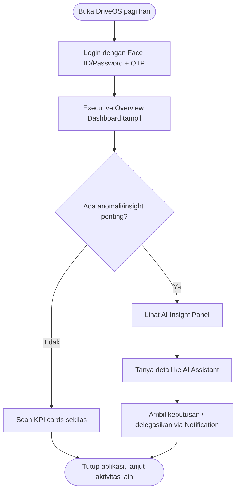
```mermaid
flowchart TD
    A([Buka DriveOS pagi hari]) --> B[Login dengan Face ID/Password + OTP]
    B --> C[Executive Overview Dashboard tampil]
    C --> D{Ada anomali/insight penting?}
    D -- Ya --> E[Lihat AI Insight Panel]
    E --> F[Tanya detail ke AI Assistant]
    F --> G[Ambil keputusan / delegasikan via Notification]
    D -- Tidak --> H[Scan KPI cards sekilas]
    H --> I([Tutup aplikasi, lanjut aktivitas lain])
    G --> I
```

### 11.2 Journey — Sales Consultant: Dari Lead Masuk ke Deal Closed

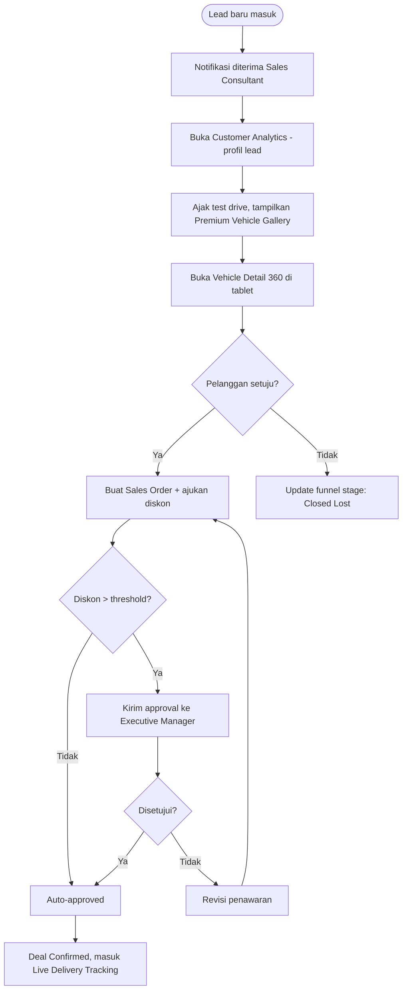
```mermaid
flowchart TD
    A([Lead baru masuk]) --> B[Notifikasi diterima Sales Consultant]
    B --> C[Buka Customer Analytics - profil lead]
    C --> D[Ajak test drive, tampilkan Premium Vehicle Gallery]
    D --> E[Buka Vehicle Detail 360 di tablet]
    E --> F{Pelanggan setuju?}
    F -- Ya --> G[Buat Sales Order + ajukan diskon]
    G --> H{Diskon > threshold?}
    H -- Ya --> I[Kirim approval ke Executive Manager]
    H -- Tidak --> J[Auto-approved]
    I --> K{Disetujui?}
    K -- Ya --> J
    K -- Tidak --> L[Revisi penawaran]
    L --> G
    J --> M[Deal Confirmed, masuk Live Delivery Tracking]
    F -- Tidak --> N[Update funnel stage: Closed Lost]
```

### 11.3 Journey — Service Advisor: Booking Servis Pelanggan

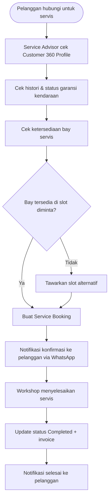
```mermaid
flowchart TD
    A([Pelanggan hubungi untuk servis]) --> B[Service Advisor cek Customer 360 Profile]
    B --> C[Cek histori & status garansi kendaraan]
    C --> D[Cek ketersediaan bay servis]
    D --> E{Bay tersedia di slot diminta?}
    E -- Ya --> F[Buat Service Booking]
    E -- Tidak --> G[Tawarkan slot alternatif]
    G --> F
    F --> H[Notifikasi konfirmasi ke pelanggan via WhatsApp]
    H --> I[Workshop menyelesaikan servis]
    I --> J[Update status Completed + invoice]
    J --> K[Notifikasi selesai ke pelanggan]
```

### 11.4 Journey — Fleet Manager: Monitoring & Live Delivery Tracking

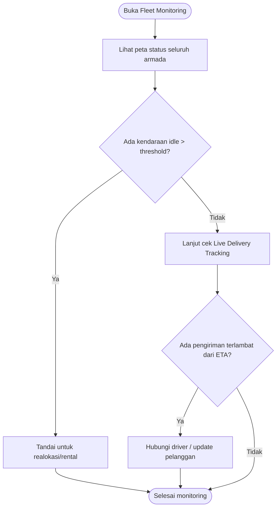
```mermaid
flowchart TD
    A([Buka Fleet Monitoring]) --> B[Lihat peta status seluruh armada]
    B --> C{Ada kendaraan idle > threshold?}
    C -- Ya --> D[Tandai untuk realokasi/rental]
    C -- Tidak --> E[Lanjut cek Live Delivery Tracking]
    E --> F{Ada pengiriman terlambat dari ETA?}
    F -- Ya --> G[Hubungi driver / update pelanggan]
    F -- Tidak --> H([Selesai monitoring])
    D --> H
    G --> H
```

---

## 12. Epics & User Stories

### EPIC-01 — Executive Intelligence
*(FEAT-001 Executive Overview Dashboard, FEAT-009 Financial Dashboard, FEAT-010 Brand Performance Comparison, FEAT-011 AI Insight Panel)*

**US-001** — Sebagai **Dealer Owner**, saya ingin melihat ringkasan KPI bisnis (revenue, unit terjual, profit, inventori, kepuasan pelanggan) dalam satu layar, agar saya bisa menilai kondisi bisnis dalam hitungan detik. — *Priority: Must*
- AC-001-1: **Given** saya login sebagai Dealer Owner, **When** Executive Overview Dashboard dimuat, **Then** sistem menampilkan minimal 5 KPI card utama (Revenue, Unit Sold, Profit Margin, Inventory Level, CSAT) dengan data ter-update maksimal 15 menit terakhir.
- AC-001-2: **Given** dashboard dimuat, **When** saya mengubah filter periode (harian/mingguan/bulanan/kustom), **Then** seluruh widget di halaman ter-update konsisten sesuai filter tanpa reload halaman penuh.
- AC-001-3: **Given** data KPI turun signifikan (>15%) dibanding periode sebelumnya, **When** dashboard dimuat, **Then** KPI card menampilkan indikator visual negatif (warna merah + ikon panah turun) dan tautan ke detail penyebab.

**US-002** — Sebagai **Finance Team**, saya ingin melihat Financial Dashboard (revenue, expense, profit margin, cash flow, rekonsiliasi pembayaran), agar saya dapat memastikan akurasi laporan keuangan. — *Priority: Must*
- AC-002-1: **Given** saya membuka Financial Dashboard, **When** halaman dimuat, **Then** sistem menampilkan breakdown revenue vs expense per kategori dan per cabang.
- AC-002-2: **Given** ada transaksi pembayaran yang belum terekonsiliasi dengan payment gateway, **When** saya membuka tab Rekonsiliasi, **Then** sistem menandai transaksi tersebut sebagai "Perlu Verifikasi".

**US-003** — Sebagai **Dealer Owner**, saya ingin membandingkan performa antar brand kendaraan (BMW vs Mercedes-Benz, dst.) dalam satu tampilan, agar saya bisa menentukan fokus stok dan promosi. — *Priority: Should*
- AC-003-1: **Given** saya membuka Brand Performance Comparison, **When** halaman dimuat, **Then** sistem menampilkan chart perbandingan unit terjual, revenue, dan margin per brand dalam periode yang dipilih.
- AC-003-2: **Given** saya memilih 2 atau lebih brand, **When** saya klik "Compare", **Then** sistem menampilkan tabel/chart side-by-side untuk brand terpilih.

**US-004** — Sebagai **Dealer Owner**, saya ingin menerima insight otomatis berbasis AI (tren, anomali, rekomendasi aksi) tanpa harus menganalisis data mentah sendiri. — *Priority: Must*
- AC-004-1: **Given** insight baru berhasil digenerate oleh sistem (job async), **When** saya membuka AI Insight Panel, **Then** sistem menampilkan daftar insight dengan judul, narasi singkat (≤3 kalimat), dan tingkat kepentingan (High/Medium/Low).
- AC-004-2: **Given** saya klik salah satu insight, **When** detail dibuka, **Then** sistem menampilkan data pendukung (chart/angka) yang menjadi dasar insight tersebut — insight tidak boleh berupa klaim tanpa data pendukung.
- AC-004-3: **Given** insight menyarankan sebuah aksi, **When** saya klik "Ambil Tindakan", **Then** sistem mengarahkan ke halaman terkait (misal Vehicle Inventory jika insight soal stok).

### EPIC-02 — Sales & Customer Experience
*(FEAT-002 Sales Intelligence, FEAT-004 Premium Vehicle Gallery, FEAT-005 Vehicle Detail 360°, FEAT-006 Customer Analytics)*

**US-005** — Sebagai **Sales Consultant**, saya ingin melihat pipeline funnel penjualan saya (New → Contacted → Test Drive → Negotiation → Closed), agar saya tahu prioritas follow-up. — *Priority: Must*
- AC-005-1: **Given** saya membuka Sales Intelligence, **When** halaman dimuat, **Then** sistem menampilkan board/list lead terkelompok per stage funnel.
- AC-005-2: **Given** saya drag lead dari satu stage ke stage lain (atau update via dropdown di mobile), **When** perubahan disimpan, **Then** sistem mencatat waktu perubahan stage dan memperbarui metrik konversi funnel.
- AC-005-3: **Given** sebuah lead tidak ada aktivitas > 7 hari (default, dapat dikonfigurasi), **When** dashboard dimuat, **Then** lead ditandai "Perlu Follow-up" dan memicu notifikasi ke Sales Consultant terkait.

**US-006** — Sebagai **Sales Consultant**, saya ingin menampilkan galeri kendaraan premium ke calon pembeli dengan visual setara katalog resmi brand, agar meningkatkan kepercayaan pelanggan. — *Priority: Must*
- AC-006-1: **Given** saya membuka Premium Vehicle Gallery, **When** halaman dimuat, **Then** sistem menampilkan grid card kendaraan dengan foto utama, brand, model, harga, dan status ketersediaan.
- AC-006-2: **Given** saya memfilter berdasarkan brand/kategori/rentang harga, **When** filter diterapkan, **Then** grid diperbarui dengan transisi halus (≤300ms) tanpa flicker.

**US-007** — Sebagai **Sales Consultant**, saya ingin menampilkan Vehicle Detail dengan 360° viewer interaktif kepada pelanggan, agar pengalaman presentasi setara showroom digital brand premium. — *Priority: Must*
- AC-007-1: **Given** kendaraan memiliki media 360° yang diunggah, **When** saya membuka Vehicle Detail, **Then** viewer 360° dapat diputar dengan drag/swipe dan menampilkan minimal 24 frame sudut pandang.
- AC-007-2: **Given** kendaraan belum memiliki media 360°, **When** halaman dimuat, **Then** sistem menampilkan galeri foto statis sebagai fallback tanpa error.
- AC-007-3: **Given** saya scroll ke bawah, **When** halaman dimuat, **Then** sistem menampilkan spesifikasi lengkap, status garansi, dan histori kendaraan (jika unit bekas/trade-in) dalam tab terpisah.

**US-008** — Sebagai **Marketing Team**, saya ingin menganalisis profil dan sumber pelanggan (lead source, segment, lifetime value), agar saya bisa mengoptimalkan kampanye. — *Priority: Should*
- AC-008-1: **Given** saya membuka Customer Analytics, **When** halaman dimuat, **Then** sistem menampilkan breakdown lead source (Walk-in, Website, WhatsApp, Referral, Iklan) dan tingkat konversi masing-masing.
- AC-008-2: **Given** saya klik satu pelanggan, **When** profil dibuka, **Then** sistem menampilkan Customer 360 Profile: riwayat pembelian, servis, dan interaksi.

### EPIC-03 — Inventory Operations
*(FEAT-003 Vehicle Inventory Management)*

**US-009** — Sebagai **Inventory Manager**, saya ingin mengelola data kendaraan (tambah, edit, ubah status, unggah media), agar data stok selalu akurat real-time. — *Priority: Must*
- AC-009-1: **Given** saya menambah kendaraan baru dengan field wajib terisi (VIN, model, varian, warna, tahun, harga), **When** saya klik Simpan, **Then** kendaraan baru berstatus "Available" dan muncul di Vehicle Inventory List.
- AC-009-2: **Given** VIN yang saya masukkan sudah terdaftar di tenant yang sama, **When** saya klik Simpan, **Then** sistem menampilkan error validasi "VIN sudah terdaftar" dan mencegah duplikasi.
- AC-009-3: **Given** sebuah kendaraan sedang dalam status "Reserved" oleh deal aktif, **When** Inventory Manager mencoba mengubah status manual menjadi "Available", **Then** sistem meminta konfirmasi eksplisit karena berpotensi konflik dengan deal berjalan.
- AC-009-4: **Given** stok tersisa untuk sebuah model ≤ threshold low-stock (default 3 unit), **When** kondisi terdeteksi, **Then** sistem mengirim notifikasi low-stock ke Inventory Manager & Dealer Owner.

### EPIC-04 — Service & Fleet Operations
*(FEAT-007 Fleet Monitoring, FEAT-008 Service Management, FEAT-012 Live Delivery Tracking)*

**US-010** — Sebagai **Fleet Manager**, saya ingin memantau status dan lokasi seluruh armada (in-use, idle, maintenance) dalam tampilan peta, agar saya bisa mengoptimalkan utilisasi. — *Priority: Must*
- AC-010-1: **Given** saya membuka Fleet Monitoring, **When** halaman dimuat, **Then** sistem menampilkan peta dengan marker kendaraan berwarna berbeda per status (in-use, idle, maintenance).
- AC-010-2: **Given** sebuah kendaraan idle > 48 jam (default, dapat dikonfigurasi), **When** kondisi terdeteksi, **Then** sistem menandai kendaraan tersebut dan memicu notifikasi ke Fleet Manager.

**US-011** — Sebagai **Service Advisor**, saya ingin membuat booking servis dengan validasi kapasitas bay, agar tidak terjadi overbooking. — *Priority: Must*
- AC-011-1: **Given** saya memilih tanggal & jam servis, **When** kapasitas bay pada slot tersebut sudah penuh, **Then** sistem menolak booking dan menyarankan slot alternatif terdekat.
- AC-011-2: **Given** booking berhasil dibuat, **When** disimpan, **Then** sistem mengirim notifikasi konfirmasi ke pelanggan via WhatsApp/Email dan menambahkan entri ke Activity Timeline.
- AC-011-3: **Given** kendaraan pelanggan masih dalam masa garansi, **When** booking dibuat untuk servis terkait item bergaransi, **Then** sistem menandai booking sebagai "Warranty Claim" dan estimasi biaya = Rp 0 (kecuali biaya di luar cakupan).

**US-012** — Sebagai **Fleet Manager**, saya ingin memantau status pengiriman kendaraan ke pelanggan secara real-time, agar saya bisa mengantisipasi keterlambatan. — *Priority: Should*
- AC-012-1: **Given** sebuah deal berstatus "Confirmed", **When** delivery dijadwalkan, **Then** sistem membuat entri Live Delivery Tracking dengan status awal "Scheduled".
- AC-012-2: **Given** driver mengupdate status pengiriman (in-transit/delivered) via form mobile, **When** update disimpan, **Then** pelanggan menerima notifikasi otomatis dan status ter-update di peta real-time (polling ≤60 detik).
- AC-012-3: **Given** waktu saat ini melewati ETA namun status masih "In Transit", **When** kondisi terdeteksi, **Then** sistem menandai pengiriman sebagai "Delayed" dan memberi tahu Fleet Manager.

### EPIC-05 — Productivity & Communication
*(FEAT-013 Activity Timeline, FEAT-014 Notification Center, FEAT-015 AI Assistant, FEAT-016 Smart Search)*

**US-013** — Sebagai **Executive Manager**, saya ingin melihat linimasa seluruh aktivitas penting (deal baru, servis, pengiriman, approval) dalam satu tempat, agar saya tidak melewatkan hal penting. — *Priority: Should*
- AC-013-1: **Given** saya membuka Activity Timeline, **When** halaman dimuat, **Then** sistem menampilkan aktivitas terurut kronologis terbaru-ke-lama dengan ikon kategori berbeda.
- AC-013-2: **Given** saya memfilter berdasarkan kategori (Sales/Service/Delivery/Approval), **When** filter diterapkan, **Then** daftar diperbarui sesuai kategori terpilih.

**US-014** — Sebagai **pengguna** (semua role), saya ingin menerima notifikasi real-time untuk kejadian relevan dengan role saya, agar saya bisa bertindak cepat. — *Priority: Must*
- AC-014-1: **Given** sebuah event terjadi (misal deal butuh approval saya), **When** event dipicu, **Then** sistem mengirim notifikasi in-app dalam ≤5 detik dan badge counter bertambah.
- AC-014-2: **Given** saya klik notifikasi, **When** diklik, **Then** sistem menandai sebagai "read" dan mengarahkan saya ke halaman terkait.
- AC-014-3: **Given** saya belum membaca notifikasi kritikal (approval, low stock) dalam 30 menit, **When** ambang waktu terlampaui, **Then** sistem mengirim reminder via channel sekunder (Email/WhatsApp) sesuai preferensi user.

**US-015** — Sebagai **Dealer Owner**, saya ingin bertanya kepada AI Assistant menggunakan bahasa natural ("Berapa unit BMW terjual bulan ini?") dan mendapat jawaban akurat berbasis data tenant saya. — *Priority: Must*
- AC-015-1: **Given** saya mengetik pertanyaan ke AI Assistant, **When** submit, **Then** sistem menjawab dalam ≤5 detik dengan data yang benar-benar berasal dari database tenant saya (tidak mengarang angka).
- AC-015-2: **Given** pertanyaan saya meminta aksi (misal "buatkan reminder follow-up untuk lead ini besok"), **When** AI Assistant memproses, **Then** sistem membuat entri task/reminder nyata dan meminta konfirmasi saya sebelum eksekusi final.
- AC-015-3: **Given** pertanyaan saya di luar cakupan data yang tersedia atau memerlukan aksi kritikal (approval diskon, perubahan data finansial), **When** diproses, **Then** AI Assistant menolak dengan sopan dan mengarahkan ke halaman/role yang berwenang — AI Assistant tidak pernah mengeksekusi aksi finansial/approval secara otonom.

**US-016** — Sebagai **pengguna**, saya ingin mencari kendaraan, pelanggan, atau deal secara cepat lintas modul, agar tidak perlu navigasi manual. — *Priority: Must*
- AC-016-1: **Given** saya mengetik ≥2 karakter di Smart Search, **When** hasil dimuat, **Then** sistem menampilkan hasil terkelompok per kategori (Kendaraan, Pelanggan, Deal, Servis) dalam ≤500ms (debounced).
- AC-016-2: **Given** tidak ada hasil ditemukan, **When** pencarian selesai, **Then** sistem menampilkan empty state dengan saran pencarian terkait.

### EPIC-06 — Reporting & Insights
*(FEAT-017 Report Center)*

**US-017** — Sebagai **Finance Team**, saya ingin men-generate dan mengekspor laporan (PDF/Excel/CSV) sesuai kebutuhan, agar saya bisa membagikan laporan ke stakeholder eksternal. — *Priority: Must*
- AC-017-1: **Given** saya memilih jenis laporan, periode, dan format, **When** saya klik "Generate", **Then** sistem memproses secara asynchronous dan menampilkan progress indicator.
- AC-017-2: **Given** proses generate selesai, **When** laporan siap, **Then** sistem mengirim notifikasi dengan tautan unduh yang valid selama 7 hari.
- AC-017-3: **Given** saya menjadwalkan laporan rutin (mingguan/bulanan), **When** jadwal tiba, **Then** sistem otomatis men-generate dan mengirim laporan ke email terdaftar.

### EPIC-07 — Platform Foundation
*(FEAT-018 User & Role Management, FEAT-019 Authentication & Security, FEAT-020 Tenant & Branch Management)*

**US-018** — Sebagai **System Administrator**, saya ingin mengelola user dan hak akses (role) di tenant saya, agar setiap orang hanya memiliki akses yang sesuai tanggung jawabnya. — *Priority: Must*
- AC-018-1: **Given** saya mengundang user baru dengan email dan role tertentu, **When** undangan dikirim, **Then** user menerima email undangan berisi tautan aktivasi akun yang valid 48 jam.
- AC-018-2: **Given** saya menonaktifkan user, **When** disimpan, **Then** user tersebut tidak bisa login lagi namun data historis (deal, log) yang terkait tetap utuh.

**US-019** — Sebagai **pengguna**, saya ingin login dengan aman (password/Google SSO + OTP untuk role sensitif), agar data bisnis saya terlindungi. — *Priority: Must*
- AC-019-1: **Given** saya memasukkan kredensial yang benar dan role saya adalah Dealer Owner/System Administrator, **When** login diverifikasi, **Then** sistem meminta OTP tambahan sebelum sesi dibuat.
- AC-019-2: **Given** saya salah memasukkan password 5 kali berturut-turut, **When** percobaan ke-5 gagal, **Then** akun dikunci sementara 15 menit dan sistem mengirim notifikasi keamanan ke email terdaftar.

**US-020** — Sebagai **Platform Super Admin**, saya ingin onboarding tenant baru (dealer/showroom) ke DriveOS, agar proses aktivasi klien baru cepat dan terkontrol. — *Priority: Must*
- AC-020-1: **Given** saya membuat tenant baru dengan data bisnis lengkap, **When** disimpan, **Then** sistem membuat akun Dealer Owner pertama secara otomatis dan mengirim kredensial awal.
- AC-020-2: **Given** sebuah tenant menunggak pembayaran subscription > grace period, **When** kondisi terdeteksi, **Then** akses tenant dibatasi ke mode read-only (bukan langsung dihapus).

---

## 13. Feature Breakdown

| FEAT ID | Nama Fitur | Deskripsi Singkat | Prioritas | Related US |
|---|---|---|---|---|
| FEAT-001 | Executive Overview Dashboard | Ringkasan KPI bisnis real-time dalam satu layar | Must | US-001 |
| FEAT-002 | Sales Intelligence | Analitik & funnel penjualan per sales/cabang | Must | US-005 |
| FEAT-003 | Vehicle Inventory Management | Pengelolaan data & status kendaraan | Must | US-009 |
| FEAT-004 | Premium Vehicle Gallery | Katalog visual kendaraan premium | Must | US-006 |
| FEAT-005 | Vehicle Detail (360° Viewer) | Halaman detail kendaraan dengan viewer 360° | Must | US-007 |
| FEAT-006 | Customer Analytics | Analitik pelanggan & Customer 360 Profile | Should | US-008 |
| FEAT-007 | Fleet Monitoring | Monitoring status & lokasi armada | Must | US-010 |
| FEAT-008 | Service Management | Booking & manajemen servis kendaraan | Must | US-011 |
| FEAT-009 | Financial Dashboard | Analitik keuangan & rekonsiliasi | Must | US-002 |
| FEAT-010 | Brand Performance Comparison | Perbandingan performa antar brand | Should | US-003 |
| FEAT-011 | AI Insight Panel | Insight otomatis berbasis AI/statistik | Must | US-004 |
| FEAT-012 | Live Delivery Tracking | Pelacakan status pengiriman kendaraan | Should | US-012 |
| FEAT-013 | Activity Timeline | Linimasa aktivitas bisnis lintas modul | Should | US-013 |
| FEAT-014 | Notification Center | Pusat notifikasi multi-channel | Must | US-014 |
| FEAT-015 | AI Assistant | Chatbot Q&A data-aware + aksi ringan | Must | US-015 |
| FEAT-016 | Smart Search | Pencarian global lintas entitas | Must | US-016 |
| FEAT-017 | Report Center | Generate & export laporan terjadwal | Must | US-017 |
| FEAT-018 | User & Role Management | Manajemen user & RBAC | Must | US-018 |
| FEAT-019 | Authentication & Security *(Assumption)* | Login, SSO, OTP 2FA, session management | Must | US-019 |
| FEAT-020 | Tenant & Branch Management *(Assumption)* | Onboarding & pengelolaan tenant/cabang multi-tenant | Must | US-020 |

---

## 14. Functional Requirements

| REQ ID | Deskripsi | Related FEAT | Prioritas |
|---|---|---|---|
| REQ-001 | Sistem menampilkan minimal 5 KPI utama di Executive Overview Dashboard dengan data ter-update ≤15 menit | FEAT-001 | Must |
| REQ-002 | Sistem mendukung filter periode (harian/mingguan/bulanan/kustom) di seluruh dashboard analitik | FEAT-001, 002, 009, 010 | Must |
| REQ-003 | Sistem menyediakan board funnel penjualan dengan drag-and-drop antar stage (desktop) dan dropdown (mobile) | FEAT-002 | Must |
| REQ-004 | Sistem mendeteksi lead tanpa aktivitas > threshold hari dan menandainya "Perlu Follow-up" | FEAT-002 | Should |
| REQ-005 | Sistem mendukung CRUD data kendaraan termasuk unggah media foto & sequence 360° | FEAT-003, 005 | Must |
| REQ-006 | Sistem mencegah duplikasi VIN dalam satu tenant | FEAT-003 | Must |
| REQ-007 | Sistem mengirim alert low-stock otomatis berdasarkan threshold per model (dapat dikonfigurasi) | FEAT-003 | Must |
| REQ-008 | Sistem menampilkan viewer 360° interaktif (drag/swipe) dengan fallback galeri foto statis | FEAT-005 | Must |
| REQ-009 | Sistem menampilkan Customer 360 Profile: riwayat pembelian, servis, dan interaksi dalam satu halaman | FEAT-006 | Should |
| REQ-010 | Sistem menampilkan peta real-time status armada (in-use/idle/maintenance) | FEAT-007 | Must |
| REQ-011 | Sistem memvalidasi kapasitas bay servis sebelum mengonfirmasi booking | FEAT-008 | Must |
| REQ-012 | Sistem otomatis menghitung status garansi berdasarkan tanggal delivery + kebijakan brand | FEAT-008 | Must |
| REQ-013 | Sistem menampilkan breakdown revenue/expense per kategori & cabang di Financial Dashboard | FEAT-009 | Must |
| REQ-014 | Sistem menandai transaksi yang belum terekonsiliasi dengan payment gateway | FEAT-009 | Should |
| REQ-015 | Sistem menampilkan perbandingan multi-brand (unit terjual, revenue, margin) side-by-side | FEAT-010 | Should |
| REQ-016 | Sistem men-generate insight AI secara asynchronous (job queue) dan meng-cache hasil per interval konfigurasi | FEAT-011 | Must |
| REQ-017 | Setiap insight AI wajib menyertakan data pendukung yang dapat ditelusuri (bukan klaim tanpa dasar) | FEAT-011 | Must |
| REQ-018 | Sistem mencatat status pengiriman (Scheduled/In Transit/Delivered/Delayed) dan mengirim notifikasi otomatis pada setiap perubahan status | FEAT-012 | Should |
| REQ-019 | Sistem menampilkan linimasa aktivitas lintas modul dengan filter kategori | FEAT-013 | Should |
| REQ-020 | Sistem mengirim notifikasi in-app real-time ≤5 detik sejak event terjadi | FEAT-014 | Must |
| REQ-021 | Sistem mengeskalasi notifikasi kritikal yang belum dibaca ke channel sekunder setelah 30 menit | FEAT-014 | Should |
| REQ-022 | AI Assistant menjawab pertanyaan berbasis data tenant secara akurat dan menolak permintaan di luar kewenangannya | FEAT-015 | Must |
| REQ-023 | AI Assistant dapat membuat task/reminder nyata dengan konfirmasi eksplisit dari user | FEAT-015 | Should |
| REQ-024 | Smart Search mengembalikan hasil lintas entitas (Kendaraan/Pelanggan/Deal/Servis) dalam ≤500ms | FEAT-016 | Must |
| REQ-025 | Sistem men-generate laporan PDF/Excel/CSV secara asynchronous dengan notifikasi saat selesai | FEAT-017 | Must |
| REQ-026 | Sistem mendukung penjadwalan laporan rutin (mingguan/bulanan) terkirim otomatis via email | FEAT-017 | Should |
| REQ-027 | Sistem mendukung invite, edit, dan nonaktifkan user dengan role granular | FEAT-018 | Must |
| REQ-028 | Sistem menegakkan RBAC di setiap endpoint API (bukan hanya di UI) | FEAT-018, 019 | Must |
| REQ-029 | Sistem mewajibkan OTP 2FA untuk role Dealer Owner & System Administrator | FEAT-019 | Must |
| REQ-030 | Sistem mengunci akun sementara setelah 5x percobaan login gagal berturut-turut | FEAT-019 | Must |
| REQ-031 | Sistem mengisolasi data antar tenant (tidak ada tenant yang bisa mengakses data tenant lain) | FEAT-020 | Must |
| REQ-032 | Sistem membatasi akses tenant menjadi read-only saat subscription menunggak melewati grace period | FEAT-020 | Should |
| REQ-033 | Seluruh halaman mendukung mode gelap & terang dengan deteksi preferensi sistem operasi otomatis | FEAT-001–020 (cross-cutting) | Must |

---

## 15. Non-Functional Requirements

| NFR ID | Kategori | Requirement | Target Metrik |
|---|---|---|---|
| NFR-001 | Performance | Time to Interactive (TTI) halaman dashboard utama | ≤ 2.5 detik (koneksi 4G) |
| NFR-002 | Performance | Largest Contentful Paint (LCP) | ≤ 2.5 detik (Core Web Vitals "Good") |
| NFR-003 | Performance | API response time (p95) untuk endpoint read standar | ≤ 300ms |
| NFR-004 | Performance | AI Assistant response time | ≤ 5 detik (termasuk pemanggilan LLM API) |
| NFR-005 | Scalability | Sistem mendukung minimal 500 concurrent user tanpa degradasi performa | ≥ 500 concurrent users |
| NFR-006 | Scalability | Arsitektur mendukung penambahan tenant baru tanpa downtime | Zero-downtime tenant provisioning |
| NFR-007 | Availability | Uptime sistem | ≥ 99.9% (≤ ~43 menit downtime/bulan) |
| NFR-008 | Security | Seluruh komunikasi data terenkripsi in-transit | TLS 1.2+ |
| NFR-009 | Security | Data sensitif (PII) terenkripsi at-rest | AES-256 |
| NFR-010 | Accessibility | Kepatuhan standar aksesibilitas | WCAG 2.2 Level AA |
| NFR-011 | Usability | Dynamic Type — teks dapat diperbesar tanpa merusak layout | Skala hingga 200% tanpa horizontal scroll |
| NFR-012 | Maintainability | Cakupan automated test (unit + integration) | ≥ 70% code coverage pada modul kritikal |
| NFR-013 | Compatibility | Dukungan browser modern | 2 versi terbaru Chrome, Safari, Edge, Firefox |
| NFR-014 | Responsiveness | Layout adaptif desktop, tablet, mobile browser | Breakpoint 375px / 768px / 1024px / 1440px |
| NFR-015 | Data Integrity | Konsistensi transaksi finansial (sales order, payment) | ACID compliance (PostgreSQL) |
| NFR-016 | Observability | Setiap request memiliki correlation/trace ID | 100% request ter-log dengan trace ID |
| NFR-017 | Localization | Dukungan Bahasa Indonesia & Inggris | i18n penuh di seluruh UI copy |
| NFR-018 | Disaster Recovery | Recovery Point Objective (RPO) & Recovery Time Objective (RTO) | RPO ≤ 1 jam, RTO ≤ 4 jam |

---

## 16. Business Rules

| RULE ID | Rule | Trigger | Outcome | Related FEAT |
|---|---|---|---|---|
| RULE-001 | Diskon ≤ 10% dari harga list dapat auto-approved | Sales Consultant mengajukan deal | Deal langsung berstatus "Confirmed" | FEAT-002 |
| RULE-002 | Diskon 10–20% membutuhkan approval Executive Manager | Sales Consultant mengajukan deal | Deal berstatus "Pending Approval" hingga disetujui/ditolak | FEAT-002 |
| RULE-003 | Diskon > 20% atau kasus khusus membutuhkan approval Dealer Owner | Sales Consultant/Executive Manager mengajukan | Deal eskalasi ke Dealer Owner | FEAT-002 |
| RULE-004 | Kendaraan berstatus "Reserved" otomatis kembali "Available" jika deal terkait dibatalkan/expired (default hold 48 jam) | Deal dibatalkan atau timer hold habis | Status kendaraan direset & notifikasi ke Inventory Manager | FEAT-003 |
| RULE-005 | Stok model ≤ threshold low-stock memicu alert | Perubahan stok kendaraan | Notifikasi ke Inventory Manager & Dealer Owner | FEAT-003 |
| RULE-006 | Booking servis tidak boleh melebihi kapasitas harian bay | Pembuatan/edit Service Booking | Sistem menolak & menyarankan slot alternatif | FEAT-008 |
| RULE-007 | Servis yang termasuk cakupan garansi aktif otomatis bernilai Rp 0 pada estimasi biaya (kecuali item di luar cakupan) | Booking servis dibuat untuk kendaraan bergaransi aktif | Estimasi biaya disesuaikan otomatis, ditandai "Warranty Claim" | FEAT-008 |
| RULE-008 | Kendaraan idle > 48 jam (fleet/rental) ditandai untuk realokasi | Job monitoring berkala (setiap 1 jam) | Notifikasi ke Fleet Manager + status "Idle - Perlu Perhatian" | FEAT-007 |
| RULE-009 | Insight AI wajib disertai data pendukung yang bisa ditelusuri; insight tanpa data sumber tidak boleh dipublikasikan ke user | Job generate insight AI | Insight hanya dipublikasikan setelah lolos validasi grounding data | FEAT-011 |
| RULE-010 | AI Assistant tidak boleh mengeksekusi aksi finansial (approval diskon, refund, perubahan harga) secara otonom | Permintaan user ke AI Assistant | Sistem menolak & mengarahkan ke halaman/role berwenang | FEAT-015 |
| RULE-011 | Notifikasi kritikal (approval pending, low stock, delivery delayed) yang belum dibaca dalam 30 menit dieskalasi ke channel sekunder | Timer notifikasi berjalan | Kirim ulang via Email/WhatsApp sesuai preferensi user | FEAT-014 |
| RULE-012 | Role Dealer Owner & System Administrator wajib OTP 2FA setiap login dari perangkat baru | Login dari device/browser baru | Sistem meminta verifikasi OTP tambahan | FEAT-019 |
| RULE-013 | Tenant yang menunggak subscription melewati grace period (default 14 hari) dibatasi menjadi read-only, bukan dihapus | Job billing berkala | Akses write dinonaktifkan, data tetap dapat dilihat | FEAT-020 |
| RULE-014 | User yang dinonaktifkan tidak dapat login namun data historis yang pernah dibuat tetap tersimpan dan tertaut ke nama user tersebut | Aksi nonaktifkan user oleh Admin | Sesi aktif user langsung diakhiri (force logout) | FEAT-018 |

---

## 17. Validation Rules

| Field/Area | Aturan Validasi |
|---|---|
| Email (login/invite user) | Format email valid RFC 5322, unik per tenant |
| Password | Minimal 10 karakter, kombinasi huruf besar/kecil, angka, simbol; tidak boleh sama dengan 5 password terakhir |
| VIN Kendaraan | Wajib 17 karakter alfanumerik, unik per tenant, tidak boleh mengandung huruf I/O/Q (standar VIN internasional) |
| Harga Kendaraan | Harus > 0, maksimal 2 desimal, mata uang IDR |
| Diskon | 0% ≤ diskon ≤ 100%, tidak boleh negatif |
| Tanggal Booking Servis | Tidak boleh tanggal lampau, maksimal H+90 dari hari ini |
| Nomor Telepon Pelanggan | Format E.164 (contoh +62812xxxxxxx), wajib untuk notifikasi WhatsApp |
| Upload Media Kendaraan | Format JPG/PNG/WebP untuk foto (maks 10MB/file), sequence 360° minimal 24 frame; format MP4 untuk video (maks 100MB) |
| Rentang Tanggal Filter Dashboard | Tanggal mulai ≤ tanggal akhir, maksimal rentang 2 tahun untuk query performa |
| Kode OTP | 6 digit numerik, berlaku 5 menit, maksimal 3 kali percobaan sebelum diblokir sementara |
| Nama Tenant/Branch | 3–100 karakter, tidak boleh mengandung karakter khusus selain `- & . ,` |

---

## 18. Edge Cases & Error Handling

| Skenario | Perilaku yang Diharapkan | Related US/REQ |
|---|---|---|
| Dua Sales Consultant mencoba mereservasi kendaraan yang sama secara bersamaan | Sistem menggunakan optimistic locking; request kedua menerima error "Kendaraan baru saja direservasi pihak lain" dan menyarankan unit alternatif | REQ-005, RULE-004 |
| Job generate AI Insight gagal (timeout LLM API) | Sistem menampilkan status "Insight gagal digenerate, dicoba ulang otomatis" dan retry dengan backoff; tidak menampilkan data parsial/rusak | REQ-016 |
| Koneksi internet user terputus saat mengisi form Service Booking | Draft form disimpan sementara di local state; saat koneksi kembali, sistem menampilkan opsi "Lanjutkan draft" | REQ-011 |
| AI Assistant menerima pertanyaan ambigu (misal "gimana penjualan kita?") | Sistem meminta klarifikasi (periode, cabang, brand) sebelum menjawab, bukan menebak asumsi | REQ-022 |
| Export laporan dengan dataset sangat besar (>100.000 baris) | Proses dialihkan ke job queue background, user menerima notifikasi saat file siap, tidak memblokir UI | REQ-025 |
| Upload sequence 360° dengan frame tidak berurutan/kurang dari minimum | Sistem menolak upload dan menampilkan pesan spesifik jumlah frame yang kurang | REQ-008 |
| User mencoba mengakses halaman di luar kewenangan role-nya (URL manual) | Sistem menampilkan halaman 403 Forbidden yang konsisten dengan design system, bukan error teknis mentah | REQ-028 |
| Payment gateway mengalami downtime saat proses pembayaran DP | Sistem menandai transaksi "Pending Verification", tidak mengubah status deal menjadi Confirmed sampai callback diterima atau diverifikasi manual oleh Finance Team | REQ-014 |
| Notifikasi WhatsApp gagal terkirim (nomor tidak valid/API down) | Sistem otomatis fallback ke Email dan mencatat kegagalan channel di log | RULE-011 |
| Tenant baru belum memiliki data (belum ada penjualan/inventori) | Seluruh dashboard menampilkan Empty State edukatif dengan CTA "Tambah Kendaraan Pertama" / "Undang Tim Anda" | Cross-cutting |

---

## 19. Information Architecture

### 19.1 Sitemap

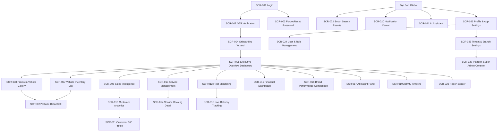
```mermaid
flowchart TD
    Login[SCR-001 Login] --> OTP[SCR-002 OTP Verification]
    Login --> Forgot[SCR-003 Forgot/Reset Password]
    OTP --> Onboard[SCR-004 Onboarding Wizard]
    Onboard --> Home

    Home[SCR-005 Executive Overview Dashboard] --> Sales[SCR-006 Sales Intelligence]
    Home --> Inventory[SCR-007 Vehicle Inventory List]
    Home --> Gallery[SCR-008 Premium Vehicle Gallery]
    Home --> Fleet[SCR-012 Fleet Monitoring]
    Home --> Service[SCR-013 Service Management]
    Home --> Finance[SCR-015 Financial Dashboard]
    Home --> Brand[SCR-016 Brand Performance Comparison]
    Home --> AIInsight[SCR-017 AI Insight Panel]
    Home --> Timeline[SCR-019 Activity Timeline]
    Home --> Reports[SCR-023 Report Center]

    Gallery --> VDetail[SCR-009 Vehicle Detail 360]
    Inventory --> VDetail
    Sales --> CustAnalytics[SCR-010 Customer Analytics]
    CustAnalytics --> Cust360[SCR-011 Customer 360 Profile]
    Service --> ServiceDetail[SCR-014 Service Booking Detail]
    Fleet --> Delivery[SCR-018 Live Delivery Tracking]

    TopBar[Top Bar: Global] --> Search[SCR-022 Smart Search Results]
    TopBar --> Notif[SCR-020 Notification Center]
    TopBar --> Assistant[SCR-021 AI Assistant]
    TopBar --> Settings[SCR-026 Profile & App Settings]

    Settings --> UserMgmt[SCR-024 User & Role Management]
    Settings --> TenantSettings[SCR-025 Tenant & Branch Settings]
    TenantSettings --> SuperAdmin[SCR-027 Platform Super Admin Console]
```

### 19.2 Screen Inventory

| SCR ID | Nama Halaman | Tujuan | Related US |
|---|---|---|---|
| SCR-001 | Login | Autentikasi user | US-019 |
| SCR-002 | OTP Verification | Verifikasi 2FA | US-019 |
| SCR-003 | Forgot/Reset Password | Pemulihan akun | US-019 |
| SCR-004 | Onboarding Wizard | Setup awal tenant baru | US-020 |
| SCR-005 | Executive Overview Dashboard | Ringkasan KPI bisnis | US-001 |
| SCR-006 | Sales Intelligence | Funnel & analitik penjualan | US-005 |
| SCR-007 | Vehicle Inventory List | Kelola daftar kendaraan | US-009 |
| SCR-008 | Premium Vehicle Gallery | Katalog visual kendaraan | US-006 |
| SCR-009 | Vehicle Detail (360°) | Detail & viewer 360° kendaraan | US-007 |
| SCR-010 | Customer Analytics | Analitik pelanggan | US-008 |
| SCR-011 | Customer 360 Profile | Profil lengkap 1 pelanggan | US-008 |
| SCR-012 | Fleet Monitoring | Peta & status armada | US-010 |
| SCR-013 | Service Management | Dashboard & kelola booking servis | US-011 |
| SCR-014 | Service Booking Detail | Detail 1 booking servis | US-011 |
| SCR-015 | Financial Dashboard | Analitik keuangan | US-002 |
| SCR-016 | Brand Performance Comparison | Perbandingan antar brand | US-003 |
| SCR-017 | AI Insight Panel | Daftar & detail insight AI | US-004 |
| SCR-018 | Live Delivery Tracking | Peta status pengiriman | US-012 |
| SCR-019 | Activity Timeline | Linimasa aktivitas | US-013 |
| SCR-020 | Notification Center | Pusat notifikasi | US-014 |
| SCR-021 | AI Assistant | Chat AI Assistant | US-015 |
| SCR-022 | Smart Search Results | Hasil pencarian global | US-016 |
| SCR-023 | Report Center | Generate & riwayat export laporan | US-017 |
| SCR-024 | User & Role Management | Kelola user & role | US-018 |
| SCR-025 | Tenant & Branch Settings | Konfigurasi tenant/cabang | US-020 |
| SCR-026 | Profile & App Settings | Profil, tema, preferensi notifikasi | Cross-cutting |
| SCR-027 | Platform Super Admin Console | Kelola seluruh tenant (internal) | US-020 |
| SCR-028 | Shared Empty/Error/404 States | State bersama seluruh halaman | Cross-cutting |

### 19.3 Navigation Structure

**Sidebar Kiri (Collapsible, persist per user):**
- Group "Overview": Executive Overview, AI Insight Panel, Activity Timeline
- Group "Sales & Customer": Sales Intelligence, Premium Vehicle Gallery, Customer Analytics
- Group "Operations": Vehicle Inventory, Service Management, Fleet Monitoring, Live Delivery Tracking
- Group "Finance": Financial Dashboard, Brand Performance Comparison
- Group "Reports": Report Center
- Group "Admin" *(hanya tampil untuk role berwenang)*: User & Role Management, Tenant & Branch Settings

**Top Bar (Frosted Glass, sticky):**
- Kiri: Logo DriveOS + nama tenant aktif (dengan switcher jika user memiliki akses multi-branch)
- Tengah: Smart Search (expandable command palette, shortcut `⌘K` / `Ctrl+K`)
- Kanan: Ikon Notification Center (badge count) → Ikon AI Assistant (floating action, selalu dapat diakses) → Avatar Profil (dropdown: Profil, Tema, Bahasa, Logout)

**Mobile:** Sidebar menjadi bottom navigation (5 ikon utama: Home, Sales, Inventory, Notifikasi, Lainnya) + AI Assistant sebagai Floating Action Button (FAB) mengambang di kanan bawah.

---

## 20. Dashboard Layout Specification & UX per Halaman

> Format tiap fitur: Tujuan Bisnis, Tujuan Pengguna, Layout & UI Components, User Interaction, Business Logic, Validasi, Edge Cases, Data & API Requirement, Database Entity.

### FEAT-001 · Executive Overview Dashboard (SCR-005)

- **Tujuan Bisnis:** Mempercepat pengambilan keputusan eksekutif melalui visibilitas KPI real-time (BG-01).
- **Tujuan Pengguna:** Dealer Owner/Executive Manager mendapat gambaran kondisi bisnis dalam <10 detik.
- **Layout:** Grid card 12-kolom (desktop). Baris 1: 5 KPI Card (Revenue, Unit Sold, Profit Margin, Inventory Level, CSAT) dengan mini sparkline trend. Baris 2: Chart Revenue Trend (2/3 lebar) + AI Insight teaser card (1/3 lebar). Baris 3: Sales Funnel mini-widget + Fleet Status mini-widget + Upcoming Activities mini-widget (3 kolom sejajar). Filter periode sticky di kanan atas header halaman.
- **UI Components:** `KpiCard`, `TrendChart` (ECharts line/area), `InsightTeaserCard`, `MiniFunnelWidget`, `MiniMapWidget`, `PeriodFilterDropdown`, `BranchSwitcher`.
- **User Interaction:** Klik KPI card → drill-down ke halaman detail terkait (misal Revenue → Financial Dashboard). Hover chart → tooltip detail angka. Ubah filter periode → seluruh widget re-fetch dengan skeleton loading, bukan reload halaman.
- **Business Logic:** Agregasi data mengacu RULE-009 (insight harus grounded data). Perbandingan periode otomatis (vs periode sebelumnya) untuk indikator naik/turun.
- **Validasi:** Rentang tanggal filter kustom maksimal 2 tahun (lihat §17).
- **Edge Cases:** Tenant baru tanpa data → Empty State edukatif (§23.2); kegagalan fetch salah satu widget tidak boleh membuat seluruh halaman gagal render (isolated widget error boundary).
- **Data Requirement:** Agregat dari `sales_order`, `vehicle`, `financial_transaction`, `notification` (CSAT survey - assumption sumber data terpisah).
- **API Requirement:** `API-001` `GET /dashboard/executive-overview`.
- **Database Entity:** `TBL-011 sales_order`, `TBL-007 vehicle`, `TBL-018 financial_transaction`.

### FEAT-002 · Sales Intelligence (SCR-006)

- **Tujuan Bisnis:** Meningkatkan konversi funnel penjualan (BG-02).
- **Tujuan Pengguna:** Sales Consultant memprioritaskan lead yang butuh follow-up; Executive Manager memantau performa tim.
- **Layout:** Toggle view "Kanban Funnel" vs "List/Table". Kanban: 5 kolom stage (New, Contacted, Test Drive, Negotiation, Closed). Header halaman: filter Sales Consultant, filter sumber lead, rentang tanggal.
- **UI Components:** `FunnelBoard` (drag-and-drop, `@dnd-kit`), `LeadCard`, `ConversionRateBadge`, `FollowUpFlag`.
- **User Interaction:** Drag lead antar kolom (desktop) / dropdown status (mobile) → update stage. Klik lead card → buka Customer 360 Profile (SCR-011).
- **Business Logic:** RULE-001–003 (approval diskon berjenjang saat lead menjadi Sales Order).
- **Validasi:** Lead wajib memiliki minimal 1 kontak (telepon/email) sebelum dapat naik ke stage "Test Drive".
- **Edge Cases:** Lead idle >7 hari ditandai otomatis (§18).
- **Data Requirement:** `lead`, `customer`, `sales_order`.
- **API Requirement:** `API-010` `GET /leads`, `API-011` `PATCH /leads/{id}/stage`.
- **Database Entity:** `TBL-010 lead`, `TBL-009 customer`.

### FEAT-003 · Vehicle Inventory Management (SCR-007)

- **Tujuan Bisnis:** Menjamin akurasi data stok real-time untuk mencegah kehilangan penjualan.
- **Tujuan Pengguna:** Inventory Manager mengelola siklus hidup data kendaraan.
- **Layout:** Table/Grid toggle dengan kolom: Foto thumbnail, VIN, Brand/Model, Varian, Status (badge warna), Harga, Cabang, Aksi. Filter panel kiri: brand, status, rentang harga, cabang.
- **UI Components:** `InventoryTable`, `StatusBadge`, `BulkActionBar`, `VehicleFormDrawer` (slide-over untuk tambah/edit).
- **User Interaction:** Klik baris → buka Vehicle Detail (SCR-009). Bulk select → ubah status/transfer cabang massal (role Inventory Manager/System Admin saja).
- **Business Logic:** RULE-004 (auto-release reserved), RULE-005 (low-stock alert).
- **Validasi:** VIN 17 karakter unik (§17); harga > 0.
- **Edge Cases:** Race condition reservasi ganda (§18).
- **Data Requirement:** `vehicle`, `vehicle_model`, `brand`, `vehicle_media`.
- **API Requirement:** `API-020`–`API-025` (lihat §25).
- **Database Entity:** `TBL-007 vehicle`, `TBL-006 vehicle_model`, `TBL-005 brand`, `TBL-008 vehicle_media`.

### FEAT-004 · Premium Vehicle Gallery (SCR-008)

- **Tujuan Bisnis:** Meningkatkan kepercayaan pelanggan & mempercepat proses penjualan melalui presentasi visual premium.
- **Tujuan Pengguna:** Sales Consultant menampilkan katalog kendaraan menarik ke calon pembeli.
- **Layout:** Full-bleed grid galeri (2–4 kolom responsif) dengan card besar: foto hero, brand logo, nama model, harga mulai dari, badge ketersediaan. Hover/tap → preview cepat (quick-look modal) sebelum masuk detail penuh.
- **UI Components:** `GalleryCard`, `QuickLookModal`, `FilterChips` (brand, kategori, rentang harga), `SortDropdown`.
- **User Interaction:** Filter chip multi-select; transisi grid halus (Framer Motion layout animation) saat filter berubah.
- **Business Logic:** Hanya menampilkan kendaraan berstatus "Available"/"Reserved" (bukan "Sold"/"In Service") kecuali toggle "Tampilkan Terjual" diaktifkan oleh internal user.
- **Validasi:** —
- **Edge Cases:** Tidak ada kendaraan sesuai filter → Empty State dengan CTA reset filter.
- **Data Requirement:** `vehicle`, `vehicle_media` (foto hero).
- **API Requirement:** `API-026` `GET /vehicles/gallery`.
- **Database Entity:** `TBL-007 vehicle`, `TBL-008 vehicle_media`.

### FEAT-005 · Vehicle Detail — 360° Viewer (SCR-009)

- **Tujuan Bisnis:** Menyamai standar pengalaman digital brand otomotif premium (diferensiasi produk).
- **Tujuan Pengguna:** Sales Consultant/pelanggan mengeksplorasi kendaraan secara mendalam.
- **Layout:** Hero section full-width berisi 360° viewer (React Three Fiber) atau galeri foto (fallback). Tab di bawah: "Spesifikasi", "Garansi", "Histori" (jika trade-in/bekas), "Harga & Simulasi".
- **UI Components:** `Vehicle360Viewer`, `SpecTable`, `WarrantyStatusCard`, `HistoryTimeline`, `StickyCTA` (Jadwalkan Test Drive / Ajukan Penawaran).
- **User Interaction:** Drag/swipe untuk memutar 360°; pinch-zoom; switch warna varian (jika tersedia) memuat ulang sequence sesuai warna.
- **Business Logic:** Status garansi dihitung otomatis dari `warranty_start`/`warranty_end` vs tanggal hari ini.
- **Validasi:** Sequence 360° minimal 24 frame (§17).
- **Edge Cases:** Media 360° belum ada → fallback galeri statis (§18); device tidak mendukung WebGL → fallback otomatis ke galeri foto tanpa error console.
- **Data Requirement:** `vehicle`, `vehicle_media`, `vehicle_model` (spesifikasi).
- **API Requirement:** `API-027` `GET /vehicles/{id}`.
- **Database Entity:** `TBL-007 vehicle`, `TBL-008 vehicle_media`, `TBL-006 vehicle_model`.

### FEAT-006 · Customer Analytics (SCR-010, SCR-011)

- **Tujuan Bisnis:** Meningkatkan retensi & lifetime value pelanggan (BG-04).
- **Tujuan Pengguna:** Marketing Team menganalisis sumber & segmen pelanggan; Sales/Service melihat riwayat lengkap 1 pelanggan.
- **Layout SCR-010:** Chart donut lead source, chart bar segment pelanggan, tabel top customers by LTV. **Layout SCR-011 (Customer 360):** Header profil (nama, kontak, segment) + tab: Riwayat Pembelian, Riwayat Servis, Interaksi/Komunikasi.
- **UI Components:** `SourceDonutChart`, `SegmentBarChart`, `CustomerTable`, `Customer360Header`, `PurchaseHistoryList`, `ServiceHistoryList`.
- **User Interaction:** Klik nama pelanggan di tabel manapun → buka Customer 360 Profile.
- **Business Logic:** LTV dihitung dari total `sales_order` + `service_booking` nilai historis pelanggan.
- **Data Requirement:** `customer`, `lead`, `sales_order`, `service_booking`, `customer_vehicle`.
- **API Requirement:** `API-030` `GET /customers/analytics`, `API-031` `GET /customers/{id}/profile`.
- **Database Entity:** `TBL-009 customer`, `TBL-014 customer_vehicle`.

### FEAT-007 · Fleet Monitoring (SCR-012)

- **Tujuan Bisnis:** Mengurangi idle asset & memaksimalkan utilisasi armada (BG-03).
- **Tujuan Pengguna:** Fleet Manager memantau status & lokasi seluruh armada.
- **Layout:** Peta interaktif (Google Maps) full-width dengan marker berwarna per status + panel list kendaraan di kanan (dapat di-collapse) menampilkan detail saat marker diklik.
- **UI Components:** `FleetMap`, `VehicleMarker`, `FleetListPanel`, `UtilizationGauge`, `StatusFilterToggle`.
- **User Interaction:** Klik marker → highlight di list & tampilkan quick info card (status, driver, odometer, last update).
- **Business Logic:** RULE-008 (idle >48 jam ditandai).
- **Data Requirement:** `fleet_vehicle`, `vehicle`.
- **API Requirement:** `API-040` `GET /fleet/vehicles`, polling/websocket untuk update lokasi.
- **Database Entity:** `TBL-017 fleet_vehicle`.

### FEAT-008 · Service Management (SCR-013, SCR-014)

- **Tujuan Bisnis:** Meningkatkan efisiensi workshop & retensi pelanggan melalui servis tepat waktu.
- **Tujuan Pengguna:** Service Advisor mengelola booking; Fleet Manager melihat status maintenance armada.
- **Layout SCR-013:** Kalender/agenda view booking per bay + KPI mini (booking hari ini, in-progress, completed). **Layout SCR-014:** Detail 1 booking — info kendaraan, pelanggan, item servis, estimasi biaya, status.
- **UI Components:** `ServiceCalendar`, `BayCapacityIndicator`, `BookingFormDrawer`, `ServiceStatusStepper`.
- **User Interaction:** Klik slot kosong di kalender → buka form booking baru pre-filled tanggal/jam.
- **Business Logic:** RULE-006 (kapasitas bay), RULE-007 (warranty claim auto Rp0).
- **Data Requirement:** `service_booking`, `service_bay`, `customer_vehicle`.
- **API Requirement:** `API-050`–`API-054`.
- **Database Entity:** `TBL-015 service_booking`, `TBL-016 service_bay`.

### FEAT-009 · Financial Dashboard (SCR-015)

- **Tujuan Bisnis:** Akurasi & transparansi laporan keuangan untuk audit dan keputusan bisnis.
- **Tujuan Pengguna:** Finance Team memantau revenue, expense, profit margin, rekonsiliasi.
- **Layout:** KPI card (Revenue, Expense, Net Profit, Margin %) + chart cash flow bulanan + tabel rekonsiliasi pembayaran dengan status.
- **UI Components:** `FinanceKpiCard`, `CashFlowChart`, `ReconciliationTable`, `TransactionStatusBadge`.
- **Business Logic:** RULE terkait rekonsiliasi — transaksi tanpa `gateway_ref` matching ditandai "Perlu Verifikasi".
- **Data Requirement:** `financial_transaction`, `payment`.
- **API Requirement:** `API-060` `GET /finance/dashboard`, `API-061` `GET /finance/reconciliation`.
- **Database Entity:** `TBL-018 financial_transaction`, `TBL-012 payment`.

### FEAT-010 · Brand Performance Comparison (SCR-016)

- **Tujuan Bisnis:** Membantu keputusan alokasi stok & promosi per brand.
- **Tujuan Pengguna:** Dealer Owner membandingkan performa brand yang dijual.
- **Layout:** Multi-select brand chips di atas + chart bar/radar perbandingan (unit terjual, revenue, margin, avg. days-to-sell) + tabel detail di bawah.
- **UI Components:** `BrandSelector`, `ComparisonBarChart`, `ComparisonRadarChart`, `BrandDetailTable`.
- **Data Requirement:** Agregasi `sales_order` + `vehicle_model` join `brand`.
- **API Requirement:** `API-070` `GET /analytics/brand-comparison`.
- **Database Entity:** `TBL-005 brand`, `TBL-006 vehicle_model`.

### FEAT-011 · AI Insight Panel (SCR-017)

- **Tujuan Bisnis:** Mempercepat time-to-insight tanpa perlu analis data internal.
- **Tujuan Pengguna:** Dealer Owner/Executive Manager menerima rekomendasi actionable.
- **Layout:** List card insight (judul, ringkasan, badge prioritas, tag kategori) + panel detail di kanan (data pendukung + chart + tombol "Ambil Tindakan").
- **UI Components:** `InsightCard`, `InsightDetailPanel`, `PriorityBadge`, `ActionButton`.
- **Business Logic:** RULE-009 — insight harus grounded data; digenerate async via job queue (lihat §22, §28.3), hybrid statistical + LLM narrative.
- **Edge Cases:** Kegagalan generate → retry otomatis (§18).
- **Data Requirement:** `ai_insight` (cache hasil), sumber agregasi dari seluruh modul.
- **API Requirement:** `API-080` `GET /ai/insights`, `API-081` `GET /ai/insights/{id}`.
- **Database Entity:** `TBL-019 ai_insight`.

### FEAT-012 · Live Delivery Tracking (SCR-018)

- **Tujuan Bisnis:** Meningkatkan pengalaman pelanggan pasca-pembelian & antisipasi keterlambatan.
- **Tujuan Pengguna:** Fleet Manager memantau status pengiriman; pelanggan menerima update transparan.
- **Layout:** Peta dengan rute + marker kendaraan yang sedang dikirim + timeline status (Scheduled → In Transit → Delivered).
- **UI Components:** `DeliveryMap`, `DeliveryStatusTimeline`, `ETABadge`, `DelayAlert`.
- **Business Logic:** Status delay otomatis jika waktu > ETA (§18).
- **Data Requirement:** `delivery`, `sales_order`.
- **API Requirement:** `API-090` `GET /deliveries`, `API-091` `PATCH /deliveries/{id}/status` (driver update).
- **Database Entity:** `TBL-013 delivery`.

### FEAT-013 · Activity Timeline (SCR-019)

- **Tujuan Bisnis:** Meningkatkan koordinasi tim & mengurangi hal yang terlewat.
- **Tujuan Pengguna:** Executive Manager melihat seluruh aktivitas penting lintas modul.
- **Layout:** Vertical timeline dengan ikon kategori, filter chip kategori, infinite scroll.
- **UI Components:** `TimelineItem`, `CategoryFilterChip`, `TimelineIcon`.
- **Data Requirement:** `timeline_event` (agregasi event dari seluruh modul).
- **API Requirement:** `API-100` `GET /timeline`.
- **Database Entity:** `TBL-023 timeline_event`.

### FEAT-014 · Notification Center (SCR-020)

- **Tujuan Bisnis:** Memastikan aksi kritikal tidak terlewat, mempercepat respons operasional.
- **Tujuan Pengguna:** Semua role menerima info relevan real-time.
- **Layout:** Dropdown panel dari topbar (preview 5 terbaru) + halaman penuh dengan tab "Semua/Belum Dibaca" dan grup per hari.
- **UI Components:** `NotificationBell` (badge), `NotificationDropdown`, `NotificationListItem`, `MarkAllReadButton`.
- **Business Logic:** RULE-011 (eskalasi channel sekunder).
- **Data Requirement:** `notification`.
- **API Requirement:** `API-110` `GET /notifications`, `API-111` `PATCH /notifications/{id}/read`.
- **Database Entity:** `TBL-021 notification`.

### FEAT-015 · AI Assistant (SCR-021)

- **Tujuan Bisnis:** Menurunkan friksi akses data & meningkatkan adopsi fitur analitik (BG-01).
- **Tujuan Pengguna:** Semua role bertanya dalam bahasa natural tanpa perlu navigasi manual.
- **Layout:** Panel chat mengambang (FAB → expand) atau halaman penuh; riwayat percakapan tersimpan per user; quick-prompt suggestions kontekstual sesuai halaman aktif.
- **UI Components:** `ChatBubble`, `ChatInput`, `QuickPromptChips`, `ActionConfirmationCard` (untuk aksi seperti buat reminder).
- **Business Logic:** RULE-010 — tidak eksekusi aksi finansial/approval otonom; setiap aksi non-baca wajib konfirmasi eksplisit user dan tercatat di `activity_log`.
- **Edge Cases:** Pertanyaan ambigu → minta klarifikasi (§18); pertanyaan di luar data tenant → tolak sopan.
- **Data Requirement:** `ai_assistant_conversation`, akses read-only terkontrol ke seluruh entitas tenant (via layer RBAC yang sama dengan REST API).
- **API Requirement:** `API-120` `POST /ai/assistant/message`.
- **Database Entity:** `TBL-020 ai_assistant_conversation`.

### FEAT-016 · Smart Search (SCR-022)

- **Tujuan Bisnis:** Meningkatkan efisiensi kerja harian (mengurangi waktu navigasi).
- **Tujuan Pengguna:** Semua role menemukan data dengan cepat.
- **Layout:** Command palette overlay (`⌘K`), hasil terkelompok per kategori dengan ikon & preview singkat.
- **UI Components:** `SearchOverlay`, `SearchResultGroup`, `SearchResultItem`, `RecentSearches`.
- **Business Logic:** Hasil difilter otomatis sesuai RBAC user (tidak menampilkan data di luar wewenang).
- **Data Requirement:** Index pencarian lintas `vehicle`, `customer`, `sales_order`, `service_booking`.
- **API Requirement:** `API-130` `GET /search?q=`.
- **Database Entity:** Cross-entity (via search index — lihat §22).

### FEAT-017 · Report Center (SCR-023)

- **Tujuan Bisnis:** Memenuhi kebutuhan pelaporan internal & eksternal (audit, investor, principal brand).
- **Tujuan Pengguna:** Finance/Marketing/Dealer Owner mengekspor data sesuai kebutuhan.
- **Layout:** Form konfigurasi laporan (jenis, filter, format, jadwal) di kiri + riwayat export (status, tautan unduh) di kanan.
- **UI Components:** `ReportBuilderForm`, `ExportHistoryTable`, `ScheduleToggle`, `FormatSelector`.
- **Business Logic:** Proses async via job queue (§22).
- **Data Requirement:** `report_export`.
- **API Requirement:** `API-140` `POST /reports/generate`, `API-141` `GET /reports/history`.
- **Database Entity:** `TBL-024 report_export`.

### FEAT-018 · User & Role Management (SCR-024)

- **Tujuan Bisnis:** Keamanan data & kepatuhan prinsip least-privilege.
- **Tujuan Pengguna:** System Administrator mengelola akses tim.
- **Layout:** Tabel user (nama, email, role, cabang, status, last login) + drawer edit role/permission granular per resource.
- **UI Components:** `UserTable`, `RoleEditorDrawer`, `PermissionMatrixEditor`, `InviteUserModal`.
- **Business Logic:** RULE-014.
- **Data Requirement:** `app_user`, `role_permission`.
- **API Requirement:** `API-150`–`API-154`.
- **Database Entity:** `TBL-003 app_user`, `TBL-004 role_permission`.

### FEAT-019 · Authentication & Security *(Assumption)* (SCR-001–003)

- **Tujuan Bisnis:** Melindungi data bisnis & pelanggan dari akses tidak sah.
- **Tujuan Pengguna:** Login cepat & aman.
- **Layout:** Form login minimalis (email/password + tombol Google SSO), layar OTP terpisah, flow reset password via email.
- **UI Components:** `LoginForm`, `OtpInput`, `PasswordStrengthMeter`, `SsoButton`.
- **Business Logic:** RULE-012, REQ-030 (lockout 5x gagal).
- **Data Requirement:** `app_user` (credential hash, mfa_enabled).
- **API Requirement:** `API-160`–`API-164`.
- **Database Entity:** `TBL-003 app_user`.

### FEAT-020 · Tenant & Branch Management *(Assumption)* (SCR-025, SCR-027)

- **Tujuan Bisnis:** Mendukung model bisnis SaaS multi-tenant (BG-05).
- **Tujuan Pengguna:** System Administrator mengatur cabang; Platform Super Admin onboarding tenant baru.
- **Layout SCR-025:** Daftar cabang + form tambah/edit cabang (nama, alamat, koordinat, jam operasional). **Layout SCR-027:** Daftar seluruh tenant (internal), status subscription, aksi suspend/aktifkan.
- **UI Components:** `BranchList`, `BranchFormDrawer`, `TenantTable` (Super Admin), `SubscriptionStatusBadge`.
- **Business Logic:** RULE-013 (grace period read-only).
- **Data Requirement:** `tenant`, `branch`.
- **API Requirement:** `API-170`–`API-174`.
- **Database Entity:** `TBL-001 tenant`, `TBL-002 branch`.

---

## 21. Apple Design System Specification

### 21.1 Prinsip Desain

1. **Content-first** — UI tidak boleh mengalahkan data; chrome (border, shadow, warna) seminimal mungkin.
2. **Deference** — Motion dan material mendukung konten, bukan jadi pusat perhatian.
3. **Clarity** — Tipografi tegas, kontras cukup, ikon presisi (SF Symbols style — outline, konsisten stroke-width).
4. **Depth** — Layer glassmorphism ringan untuk hierarki (navigasi mengambang di atas konten), bukan dekorasi berlebihan.

### 21.2 Grid & Spacing

- **8pt Grid System** — seluruh spacing (padding, margin, gap) kelipatan 8px (8, 16, 24, 32, 40, 48, 64).
- **Container max-width:** 1440px (desktop), dengan gutter 32px.
- **Rounded corner:** 24px untuk card besar (dashboard widget), 16px untuk elemen sekunder (badge, chip besar), 12px untuk button & input.

### 21.3 Tipografi

| Token | Font | Ukuran | Weight | Penggunaan |
|---|---|---|---|---|
| `text-display` | SF Pro Display | 34px | Bold | Judul halaman utama |
| `text-title-1` | SF Pro Display | 28px | Semibold | Judul section |
| `text-title-2` | SF Pro Display | 22px | Semibold | Judul card |
| `text-headline` | SF Pro Text | 17px | Semibold | Label KPI, nama entitas |
| `text-body` | SF Pro Text | 15px | Regular | Body text |
| `text-caption` | SF Pro Text | 13px | Regular | Metadata, timestamp |
| `text-footnote` | SF Pro Text | 11px | Regular | Legal/disclaimer |

*Fallback font (web tidak memiliki lisensi SF Pro publik): `-apple-system, "SF Pro Display", "Inter", system-ui, sans-serif` — Dynamic Type mendukung scaling hingga 200% via `rem` unit, bukan `px` fixed.*

### 21.4 Warna (Apple-inspired, Dual Theme)

| Token | Light Mode | Dark Mode | Penggunaan |
|---|---|---|---|
| `--bg-primary` | `#F5F5F7` | `#000000` | Latar utama |
| `--bg-surface` | `#FFFFFFCC` (glass) | `#1C1C1ECC` (glass) | Card/panel dengan blur |
| `--text-primary` | `#1D1D1F` | `#F5F5F7` | Teks utama |
| `--text-secondary` | `#6E6E73` | `#98989D` | Teks sekunder |
| `--accent-blue` | `#0071E3` | `#2997FF` | Primary action (Apple Blue) |
| `--accent-red` | `#FF3B30` | `#FF453A` | Error/negatif |
| `--accent-green` | `#34C759` | `#30D158` | Sukses/positif |
| `--accent-amber` | `#FF9F0A` | `#FF9F0A` | Warning |
| `--divider` | `#D2D2D7` | `#38383A` | Border/separator tipis |
| `--brand-automotive` | Gradient aksen otomotif (dapat dikustomisasi per tenant: contoh BMW Blue `#0166B1`, Porsche Red `#D5001C`) | idem | Aksen brand/CTA kendaraan premium |

### 21.5 Material — Glassmorphism Ringan

- Navigasi (Top Bar, Sidebar): `backdrop-filter: blur(20px) saturate(180%)`, background semi-transparan (`--bg-surface`), border 1px `--divider` opacity 40%.
- Card dashboard: shadow lembut `0 8px 24px rgba(0,0,0,0.08)` (light) / `rgba(0,0,0,0.4)` (dark) — **tidak** memakai blur berat di atas card konten (agar data tetap tajam terbaca, sesuai prinsip content-first).

### 21.6 Ikon

- Gaya outline modern setara SF Symbols (stroke-width konsisten 1.5px), ukuran dasar 20/24px, menggunakan `lucide-react` sebagai pengganti praktis SF Symbols di web (lisensi terbuka, visual selaras).

### 21.7 Motion (Framer Motion)

| Interaksi | Durasi | Easing |
|---|---|---|
| Hover card / button | 150ms | `ease-out` |
| Transisi halaman/tab | 250ms | `cubic-bezier(0.22, 1, 0.36, 1)` (Apple-style "spring-ish") |
| Modal/drawer masuk-keluar | 300ms | `spring (stiffness: 300, damping: 30)` |
| Filter grid re-layout (gallery) | 300ms | `layout` animation Framer Motion |
| Skeleton → Content reveal | 200ms | `ease-in-out` fade + slight translateY |

*Prinsip: motion selalu punya tujuan fungsional (memberi konteks perpindahan), tidak dekoratif semata.*

---

## 22. Component Specification (Design System Library)

| Komponen | Varian | Props Kunci | Catatan Aksesibilitas |
|---|---|---|---|
| `KpiCard` | default, compact, negative-trend | `title, value, delta, trend, icon` | `aria-label` mendeskripsikan tren (misal "naik 12%") |
| `Button` (shadcn/ui base) | primary, secondary, destructive, ghost | `variant, size, loading` | Focus ring visible, target tap ≥44x44px |
| `Card` | default, glass, elevated | `padding, rounded` | Kontras teks-vs-background ≥4.5:1 |
| `StatusBadge` | success, warning, danger, neutral | `label, color` | Tidak mengandalkan warna saja — selalu disertai ikon/teks |
| `DataTable` | sortable, selectable, paginated | `columns, rows, onRowClick` | Header dengan `scope="col"`, keyboard navigable |
| `FilterChip` | selected/unselected | `label, active, onToggle` | `role="checkbox"`, `aria-checked` |
| `Modal/Drawer` | center-modal, side-drawer, bottom-sheet(mobile) | `open, onClose` | Focus trap, `Esc` menutup, return focus ke trigger |
| `ChatBubble` (AI Assistant) | user, assistant, action-confirmation | `content, role, actions` | Live region `aria-live="polite"` untuk respons streaming |
| `Vehicle360Viewer` | full, compact | `frames[], autoRotate` | Kontrol keyboard (panah kiri/kanan memutar), alternatif teks "Lihat spesifikasi" bagi yang tidak bisa menggunakan interaksi drag |
| `NotificationBell` | with-badge | `count, onClick` | `aria-label="Notifikasi, {count} belum dibaca"` |
| `ThemeToggle` | light/dark/system | `mode, onChange` | Persist preferensi ke `app_user.theme_preference` |

---

## 23. State Handling (Loading, Empty, Error, Success)

### 23.1 Loading State
- Skeleton screen (bukan spinner generik) yang meniru bentuk akhir konten (card outline, baris tabel abu-abu berdenyut halus `pulse` 1.5s).
- Widget dimuat secara independen (streaming/progressive) — widget yang datanya sudah siap langsung tampil, tidak menunggu seluruh halaman.

### 23.2 Empty State
- Ilustrasi/ikon minimalis + judul singkat + deskripsi 1 kalimat + CTA jelas.
- Contoh: Vehicle Inventory kosong → ikon mobil outline, "Belum ada kendaraan", "Tambahkan kendaraan pertama Anda untuk mulai mengelola inventori.", tombol "+ Tambah Kendaraan".

### 23.3 Error State
- Error per-widget (isolated) menampilkan pesan ringkas + tombol "Coba Lagi", tidak mem-block widget lain.
- Error halaman penuh (403/404/500) menggunakan layout konsisten dengan ilustrasi netral, kode status, dan tombol kembali ke Executive Overview.
- Pesan error selalu bahasa manusia ("Gagal memuat data servis, coba lagi") — tidak menampilkan stack trace/error teknis mentah ke end-user.

### 23.4 Success State
- Toast notification (auto-dismiss 4 detik, dapat di-dismiss manual) dengan ikon centang hijau untuk aksi ringan (simpan, kirim).
- Untuk aksi signifikan (approval deal, generate report), gunakan modal konfirmasi ringkas + redirect/refresh data terkait.

---

## 24. Responsive Behavior

| Breakpoint | Device | Perilaku Layout |
|---|---|---|
| < 375px – 767px | Mobile | Sidebar → Bottom Navigation (5 ikon); grid card menjadi 1 kolom; tabel menjadi list card; AI Assistant sebagai FAB |
| 768px – 1023px | Tablet | Sidebar collapsible (ikon saja, expand on tap); grid 2 kolom; 360° viewer optimal untuk presentasi tablet ke pelanggan |
| 1024px – 1439px | Desktop kecil/laptop | Sidebar penuh, grid 2–3 kolom |
| ≥ 1440px | Desktop besar | Grid penuh hingga 4 kolom, max-width container 1440px, sisa ruang menggunakan margin simetris |

*Prinsip: konten & aksi utama harus dapat diakses tanpa horizontal scroll di semua breakpoint; data table kompleks (misal Vehicle Inventory) menyediakan mode "card view" otomatis di mobile.*

---

## 25. API Requirements

> Base URL: `https://api.driveos.app/v1` · Auth: `Bearer <JWT>` kecuali dinyatakan lain. Semua endpoint tunduk pada RBAC (§31) dan tenant isolation (RULE-013... REQ-031).

### 25.1 Authentication & Security

| API ID | Method + Path | Purpose | Auth | Request (ringkas) | Response (ringkas) | FEAT/TBL |
|---|---|---|---|---|---|---|
| API-160 | `POST /auth/login` | Login email/password | Public | `email, password` | `access_token, refresh_token` atau `mfa_required: true` | FEAT-019 / TBL-003 |
| API-161 | `POST /auth/login/google` | Login via Google SSO | Public | `google_id_token` | `access_token, refresh_token` | FEAT-019 |
| API-162 | `POST /auth/otp/verify` | Verifikasi OTP 2FA | Public (session sementara) | `otp_code, session_token` | `access_token, refresh_token` | FEAT-019 |
| API-163 | `POST /auth/refresh` | Refresh access token | Refresh token | `refresh_token` | `access_token` | FEAT-019 |
| API-164 | `POST /auth/forgot-password` / `POST /auth/reset-password` | Pemulihan password | Public | `email` / `token, new_password` | `200 OK` | FEAT-019 |

### 25.2 Tenant & Branch Management

| API ID | Method + Path | Purpose | Auth | Related |
|---|---|---|---|---|
| API-170 | `POST /platform/tenants` | Buat tenant baru | Super Admin | FEAT-020 / TBL-001 |
| API-171 | `GET /platform/tenants` | Daftar seluruh tenant | Super Admin | FEAT-020 |
| API-172 | `PATCH /platform/tenants/{id}/status` | Suspend/aktifkan tenant | Super Admin | FEAT-020, RULE-013 |
| API-173 | `GET /branches` / `POST /branches` | Kelola cabang | Dealer Owner, System Admin | FEAT-020 / TBL-002 |
| API-174 | `PATCH /branches/{id}` | Edit data cabang | Dealer Owner, System Admin | FEAT-020 |

### 25.3 Dashboard & Analytics

| API ID | Method + Path | Purpose | Related |
|---|---|---|---|
| API-001 | `GET /dashboard/executive-overview?period=` | Data agregat Executive Dashboard | FEAT-001 |
| API-070 | `GET /analytics/brand-comparison?brands[]=` | Perbandingan brand | FEAT-010 |
| API-060 | `GET /finance/dashboard?period=` | Data Financial Dashboard | FEAT-009 |
| API-061 | `GET /finance/reconciliation` | Daftar transaksi rekonsiliasi | FEAT-009 |

### 25.4 Sales & Customer

| API ID | Method + Path | Purpose | Related |
|---|---|---|---|
| API-010 | `GET /leads?stage=&sales_id=` | Daftar lead/funnel | FEAT-002 / TBL-010 |
| API-011 | `PATCH /leads/{id}/stage` | Update stage funnel | FEAT-002 |
| API-012 | `POST /sales-orders` | Buat deal/sales order | FEAT-002 / TBL-011 |
| API-013 | `POST /sales-orders/{id}/approve` \| `/reject` | Approval diskon berjenjang | FEAT-002, RULE-001–003 |
| API-030 | `GET /customers/analytics?period=` | Analitik pelanggan | FEAT-006 |
| API-031 | `GET /customers/{id}/profile` | Customer 360 Profile | FEAT-006 / TBL-009 |

### 25.5 Vehicle & Inventory

| API ID | Method + Path | Purpose | Related |
|---|---|---|---|
| API-020 | `GET /vehicles` | Daftar kendaraan (filter brand/status/harga) | FEAT-003 / TBL-007 |
| API-021 | `POST /vehicles` | Tambah kendaraan | FEAT-003 |
| API-022 | `PATCH /vehicles/{id}` | Edit data kendaraan | FEAT-003 |
| API-023 | `PATCH /vehicles/{id}/status` | Ubah status (reserve/release/sold) | FEAT-003, RULE-004 |
| API-024 | `POST /vehicles/{id}/media` | Upload foto/360°/video | FEAT-003, FEAT-005 / TBL-008 |
| API-025 | `POST /vehicles/bulk-transfer` | Transfer stok massal antar cabang | FEAT-003 |
| API-026 | `GET /vehicles/gallery` | Data Premium Vehicle Gallery | FEAT-004 |
| API-027 | `GET /vehicles/{id}` | Detail kendaraan + spesifikasi + garansi + histori | FEAT-005 |

### 25.6 Fleet, Service & Delivery

| API ID | Method + Path | Purpose | Related |
|---|---|---|---|
| API-040 | `GET /fleet/vehicles` | Status & lokasi armada | FEAT-007 / TBL-017 |
| API-041 | `PATCH /fleet/vehicles/{id}/location` | Update lokasi (driver/GPS feed) | FEAT-007 |
| API-050 | `GET /service-bookings?date=&bay_id=` | Daftar booking servis | FEAT-008 / TBL-015 |
| API-051 | `POST /service-bookings` | Buat booking servis | FEAT-008, RULE-006, 007 |
| API-052 | `PATCH /service-bookings/{id}/status` | Update status servis | FEAT-008 |
| API-053 | `GET /service-bays` | Kapasitas bay servis | FEAT-008 / TBL-016 |
| API-090 | `GET /deliveries` | Daftar & status pengiriman | FEAT-012 / TBL-013 |
| API-091 | `PATCH /deliveries/{id}/status` | Update status pengiriman (driver) | FEAT-012 |

### 25.7 AI, Search, Notifikasi, Reporting

| API ID | Method + Path | Purpose | Related |
|---|---|---|---|
| API-080 | `GET /ai/insights?category=&priority=` | Daftar insight AI | FEAT-011 / TBL-019 |
| API-081 | `GET /ai/insights/{id}` | Detail insight + data pendukung | FEAT-011 |
| API-120 | `POST /ai/assistant/message` | Kirim pesan ke AI Assistant | FEAT-015 / TBL-020 |
| API-121 | `GET /ai/assistant/conversations` | Riwayat percakapan | FEAT-015 |
| API-130 | `GET /search?q=&types[]=` | Smart Search lintas entitas | FEAT-016 |
| API-100 | `GET /timeline?category=&cursor=` | Activity Timeline (cursor pagination) | FEAT-013 / TBL-023 |
| API-110 | `GET /notifications?status=` | Daftar notifikasi | FEAT-014 / TBL-021 |
| API-111 | `PATCH /notifications/{id}/read` \| `PATCH /notifications/read-all` | Tandai dibaca | FEAT-014 |
| API-140 | `POST /reports/generate` | Generate laporan (async job) | FEAT-017 / TBL-024 |
| API-141 | `GET /reports/history` | Riwayat export laporan | FEAT-017 |
| API-142 | `POST /reports/schedule` | Jadwalkan laporan rutin | FEAT-017 |

### 25.8 User & Role Management

| API ID | Method + Path | Purpose | Related |
|---|---|---|---|
| API-150 | `GET /users` | Daftar user tenant | FEAT-018 / TBL-003 |
| API-151 | `POST /users/invite` | Undang user baru | FEAT-018 |
| API-152 | `PATCH /users/{id}` | Edit data/role user | FEAT-018 |
| API-153 | `PATCH /users/{id}/deactivate` | Nonaktifkan user | FEAT-018, RULE-014 |
| API-154 | `GET /roles/permissions` \| `PATCH /roles/{role}/permissions` | Kelola permission matrix | FEAT-018 / TBL-004 |

*Semua response error mengikuti format standar: `{ "error": { "code": "STRING_CODE", "message": "Pesan human-readable", "details": {} } }` dengan HTTP status code sesuai (400 validasi, 401 unauthenticated, 403 forbidden RBAC, 404 not found, 409 conflict/race-condition, 422 unprocessable, 429 rate-limited, 500 server error).*

---

## 26. Database Design

### 26.1 Entity Relationship Diagram (ERD)

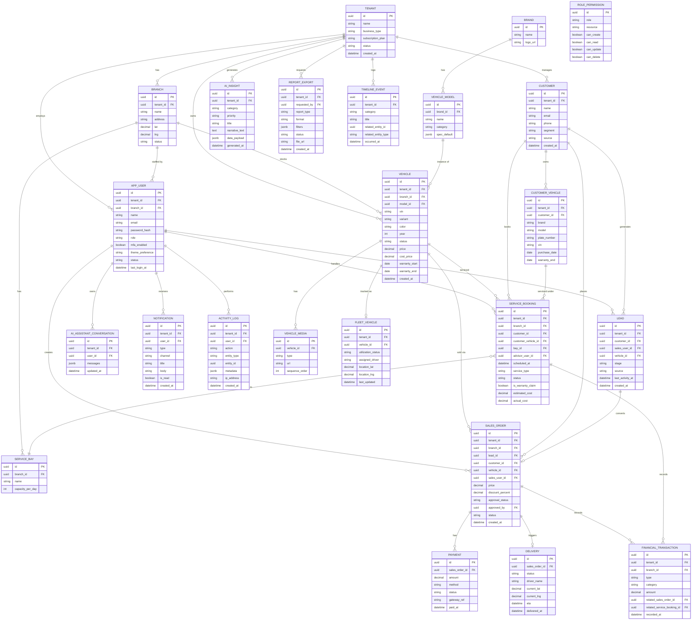
```mermaid
erDiagram
    TENANT ||--o{ BRANCH : has
    TENANT ||--o{ APP_USER : employs
    TENANT ||--o{ VEHICLE : owns
    TENANT ||--o{ CUSTOMER : manages
    BRANCH ||--o{ APP_USER : "staffed by"
    BRANCH ||--o{ VEHICLE : stocks
    BRANCH ||--o{ SERVICE_BAY : has

    APP_USER ||--o{ LEAD : "assigned to"
    APP_USER ||--o{ SALES_ORDER : creates
    APP_USER ||--o{ SERVICE_BOOKING : handles
    APP_USER ||--o{ AI_ASSISTANT_CONVERSATION : owns
    APP_USER ||--o{ NOTIFICATION : receives
    APP_USER ||--o{ ACTIVITY_LOG : performs

    BRAND ||--o{ VEHICLE_MODEL : has
    VEHICLE_MODEL ||--o{ VEHICLE : "instance of"
    VEHICLE ||--o{ VEHICLE_MEDIA : has
    VEHICLE ||--o| FLEET_VEHICLE : "tracked as"
    VEHICLE ||--o{ SALES_ORDER : "sold via"
    VEHICLE ||--o{ SERVICE_BOOKING : serviced

    CUSTOMER ||--o{ LEAD : generates
    CUSTOMER ||--o{ SALES_ORDER : places
    CUSTOMER ||--o{ CUSTOMER_VEHICLE : owns
    CUSTOMER ||--o{ SERVICE_BOOKING : books

    CUSTOMER_VEHICLE ||--o{ SERVICE_BOOKING : "serviced under"

    LEAD ||--o| SALES_ORDER : converts
    SALES_ORDER ||--o{ PAYMENT : has
    SALES_ORDER ||--o| DELIVERY : triggers
    SALES_ORDER ||--o{ FINANCIAL_TRANSACTION : records

    SERVICE_BOOKING }o--|| SERVICE_BAY : "assigned to"
    SERVICE_BOOKING ||--o{ FINANCIAL_TRANSACTION : records

    TENANT ||--o{ AI_INSIGHT : generates
    TENANT ||--o{ REPORT_EXPORT : requests
    TENANT ||--o{ TIMELINE_EVENT : logs

    TENANT {
        uuid id PK
        string name
        string business_type
        string subscription_plan
        string status
        datetime created_at
    }
    BRANCH {
        uuid id PK
        uuid tenant_id FK
        string name
        string address
        decimal lat
        decimal lng
        string status
    }
    APP_USER {
        uuid id PK
        uuid tenant_id FK
        uuid branch_id FK
        string name
        string email
        string password_hash
        string role
        boolean mfa_enabled
        string theme_preference
        string status
        datetime last_login_at
    }
    ROLE_PERMISSION {
        uuid id PK
        string role
        string resource
        boolean can_create
        boolean can_read
        boolean can_update
        boolean can_delete
    }
    BRAND {
        uuid id PK
        string name
        string logo_url
    }
    VEHICLE_MODEL {
        uuid id PK
        uuid brand_id FK
        string name
        string category
        jsonb spec_default
    }
    VEHICLE {
        uuid id PK
        uuid tenant_id FK
        uuid branch_id FK
        uuid model_id FK
        string vin
        string variant
        string color
        int year
        string status
        decimal price
        decimal cost_price
        date warranty_start
        date warranty_end
        datetime created_at
    }
    VEHICLE_MEDIA {
        uuid id PK
        uuid vehicle_id FK
        string type
        string url
        int sequence_order
    }
    CUSTOMER {
        uuid id PK
        uuid tenant_id FK
        string name
        string email
        string phone
        string segment
        string source
        datetime created_at
    }
    CUSTOMER_VEHICLE {
        uuid id PK
        uuid tenant_id FK
        uuid customer_id FK
        string brand
        string model
        string plate_number
        string vin
        date purchase_date
        date warranty_end
    }
    LEAD {
        uuid id PK
        uuid tenant_id FK
        uuid customer_id FK
        uuid sales_user_id FK
        uuid vehicle_id FK
        string stage
        string source
        datetime last_activity_at
        datetime created_at
    }
    SALES_ORDER {
        uuid id PK
        uuid tenant_id FK
        uuid branch_id FK
        uuid lead_id FK
        uuid customer_id FK
        uuid vehicle_id FK
        uuid sales_user_id FK
        decimal price
        decimal discount_percent
        string approval_status
        uuid approved_by FK
        string status
        datetime created_at
    }
    PAYMENT {
        uuid id PK
        uuid sales_order_id FK
        decimal amount
        string method
        string status
        string gateway_ref
        datetime paid_at
    }
    DELIVERY {
        uuid id PK
        uuid sales_order_id FK
        string status
        string driver_name
        decimal current_lat
        decimal current_lng
        datetime eta
        datetime delivered_at
    }
    SERVICE_BAY {
        uuid id PK
        uuid branch_id FK
        string name
        int capacity_per_day
    }
    SERVICE_BOOKING {
        uuid id PK
        uuid tenant_id FK
        uuid branch_id FK
        uuid customer_id FK
        uuid customer_vehicle_id FK
        uuid bay_id FK
        uuid advisor_user_id FK
        datetime scheduled_at
        string service_type
        string status
        boolean is_warranty_claim
        decimal estimated_cost
        decimal actual_cost
    }
    FLEET_VEHICLE {
        uuid id PK
        uuid tenant_id FK
        uuid vehicle_id FK
        string utilization_status
        string assigned_driver
        decimal location_lat
        decimal location_lng
        datetime last_updated
    }
    FINANCIAL_TRANSACTION {
        uuid id PK
        uuid tenant_id FK
        uuid branch_id FK
        string type
        string category
        decimal amount
        uuid related_sales_order_id FK
        uuid related_service_booking_id FK
        datetime recorded_at
    }
    AI_INSIGHT {
        uuid id PK
        uuid tenant_id FK
        string category
        string priority
        string title
        text narrative_text
        jsonb data_payload
        datetime generated_at
    }
    AI_ASSISTANT_CONVERSATION {
        uuid id PK
        uuid tenant_id FK
        uuid user_id FK
        jsonb messages
        datetime updated_at
    }
    NOTIFICATION {
        uuid id PK
        uuid tenant_id FK
        uuid user_id FK
        string type
        string channel
        string title
        string body
        boolean is_read
        datetime created_at
    }
    ACTIVITY_LOG {
        uuid id PK
        uuid tenant_id FK
        uuid user_id FK
        string action
        string entity_type
        uuid entity_id
        jsonb metadata
        string ip_address
        datetime created_at
    }
    TIMELINE_EVENT {
        uuid id PK
        uuid tenant_id FK
        string category
        string title
        uuid related_entity_id
        string related_entity_type
        datetime occurred_at
    }
    REPORT_EXPORT {
        uuid id PK
        uuid tenant_id FK
        uuid requested_by FK
        string report_type
        string format
        jsonb filters
        string status
        string file_url
        datetime created_at
    }
```

### 26.2 Table Definitions

| TBL ID | Tabel | Deskripsi Singkat | Owner (Fitur) |
|---|---|---|---|
| TBL-001 | `tenant` | Data perusahaan/dealer (root multi-tenant) | FEAT-020 |
| TBL-002 | `branch` | Cabang/showroom di bawah 1 tenant | FEAT-020 |
| TBL-003 | `app_user` | Akun pengguna & kredensial | FEAT-018, 019 |
| TBL-004 | `role_permission` | Matriks permission per role/resource | FEAT-018 |
| TBL-005 | `brand` | Master data brand kendaraan | FEAT-003, 010 |
| TBL-006 | `vehicle_model` | Master model per brand + spesifikasi default | FEAT-003, 005 |
| TBL-007 | `vehicle` | Unit kendaraan fisik (VIN-level) | FEAT-003, 004, 005 |
| TBL-008 | `vehicle_media` | Foto/360°/video per kendaraan | FEAT-004, 005 |
| TBL-009 | `customer` | Data pelanggan | FEAT-002, 006 |
| TBL-010 | `lead` | Prospek penjualan (funnel) | FEAT-002 |
| TBL-011 | `sales_order` | Deal/transaksi penjualan | FEAT-002, 009 |
| TBL-012 | `payment` | Transaksi pembayaran per sales order | FEAT-009 |
| TBL-013 | `delivery` | Status pengiriman kendaraan | FEAT-012 |
| TBL-014 | `customer_vehicle` | Kendaraan milik pelanggan (untuk servis) | FEAT-006, 008 |
| TBL-015 | `service_booking` | Booking servis | FEAT-008 |
| TBL-016 | `service_bay` | Kapasitas bay servis per cabang | FEAT-008 |
| TBL-017 | `fleet_vehicle` | Data utilisasi & lokasi armada | FEAT-007 |
| TBL-018 | `financial_transaction` | Catatan transaksi keuangan | FEAT-009 |
| TBL-019 | `ai_insight` | Cache hasil insight AI | FEAT-011 |
| TBL-020 | `ai_assistant_conversation` | Riwayat chat AI Assistant | FEAT-015 |
| TBL-021 | `notification` | Notifikasi per user | FEAT-014 |
| TBL-022 | `activity_log` | Audit log keamanan/sistem | FEAT-019, §32 |
| TBL-023 | `timeline_event` | Event agregat untuk Activity Timeline | FEAT-013 |
| TBL-024 | `report_export` | Riwayat & status export laporan | FEAT-017 |

*Seluruh tabel memiliki kolom `tenant_id` (kecuali `role_permission` yang bersifat global-per-role, dan `brand`/`vehicle_model` yang merupakan master data bersama) dan dilindungi PostgreSQL Row-Level Security berbasis `tenant_id` sesuai sesi JWT — lihat §27 & §32.*

*Indexing wajib: composite index `(tenant_id, status)` pada `vehicle`, `sales_order`, `service_booking`; index `(tenant_id, created_at DESC)` pada `notification`, `activity_log`, `timeline_event` untuk query pagination cepat; full-text index (`pg_trgm`/`tsvector`) pada `vehicle.vin`, `customer.name`, `customer.phone` untuk Smart Search (FEAT-016).*

---

## 27. System Architecture

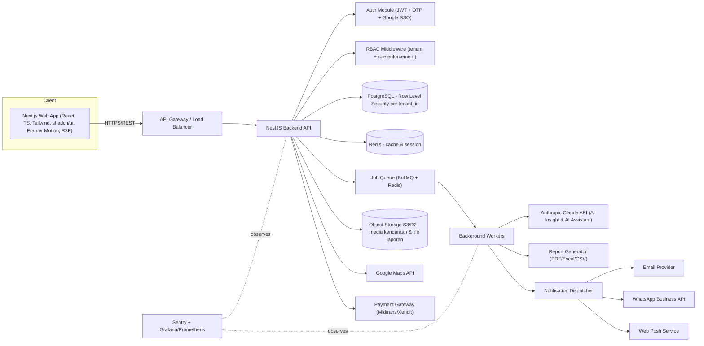
```mermaid
flowchart LR
    subgraph Client
        Web["Next.js Web App (React, TS, Tailwind, shadcn/ui, Framer Motion, R3F)"]
    end

    Web -->|HTTPS/REST| Gateway["API Gateway / Load Balancer"]
    Gateway --> API["NestJS Backend API"]

    API --> Auth["Auth Module (JWT + OTP + Google SSO)"]
    API --> RBAC["RBAC Middleware (tenant + role enforcement)"]
    API --> DB[("PostgreSQL - Row Level Security per tenant_id")]
    API --> Cache[("Redis - cache & session")]
    API --> Queue["Job Queue (BullMQ + Redis)"]
    Queue --> Worker["Background Workers"]

    Worker --> LLM["Anthropic Claude API (AI Insight & AI Assistant)"]
    Worker --> ReportGen["Report Generator (PDF/Excel/CSV)"]
    Worker --> NotifWorker["Notification Dispatcher"]

    NotifWorker --> Email["Email Provider"]
    NotifWorker --> WA["WhatsApp Business API"]
    NotifWorker --> Push["Web Push Service"]

    API --> Storage[("Object Storage S3/R2 - media kendaraan & file laporan")]
    API --> Maps["Google Maps API"]
    API --> PG["Payment Gateway (Midtrans/Xendit)"]

    Monitor["Sentry + Grafana/Prometheus"] -.observes.- API
    Monitor -.observes.- Worker
```

**Catatan arsitektur:**
- **Tenant isolation** ditegakkan di 2 lapis: (1) middleware RBAC di NestJS memvalidasi `tenant_id` dari JWT pada setiap request, (2) PostgreSQL Row-Level Security sebagai lapis pertahanan kedua (defense-in-depth) — bukan hanya mengandalkan filter aplikasi.
- **AI Insight** diproses async melalui `Queue`/`Worker` agar tidak membebani request-response utama dan hasilnya di-cache (`ai_insight` table) — bukan dipanggil real-time setiap dashboard dibuka (mitigasi NFR-004, RISK terkait biaya/latency LLM).
- **Redis** berfungsi ganda: session/cache layer dan backend untuk job queue (BullMQ), sesuai stack yang diberikan stakeholder.

---

## 28. Sequence Diagrams

### 28.1 Login dengan OTP 2FA

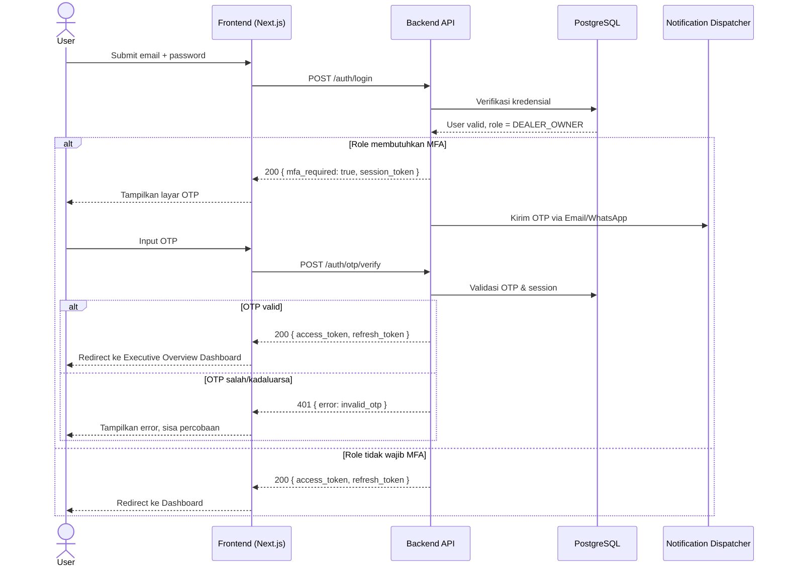
```mermaid
sequenceDiagram
    actor User
    participant FE as Frontend (Next.js)
    participant API as Backend API
    participant DB as PostgreSQL
    participant Notif as Notification Dispatcher

    User->>FE: Submit email + password
    FE->>API: POST /auth/login
    API->>DB: Verifikasi kredensial
    DB-->>API: User valid, role = DEALER_OWNER
    alt Role membutuhkan MFA
        API-->>FE: 200 { mfa_required: true, session_token }
        FE-->>User: Tampilkan layar OTP
        API->>Notif: Kirim OTP via Email/WhatsApp
        User->>FE: Input OTP
        FE->>API: POST /auth/otp/verify
        API->>DB: Validasi OTP & session
        alt OTP valid
            API-->>FE: 200 { access_token, refresh_token }
            FE-->>User: Redirect ke Executive Overview Dashboard
        else OTP salah/kadaluarsa
            API-->>FE: 401 { error: invalid_otp }
            FE-->>User: Tampilkan error, sisa percobaan
        end
    else Role tidak wajib MFA
        API-->>FE: 200 { access_token, refresh_token }
        FE-->>User: Redirect ke Dashboard
    end
```

### 28.2 Pengajuan Deal dengan Approval Diskon Berjenjang

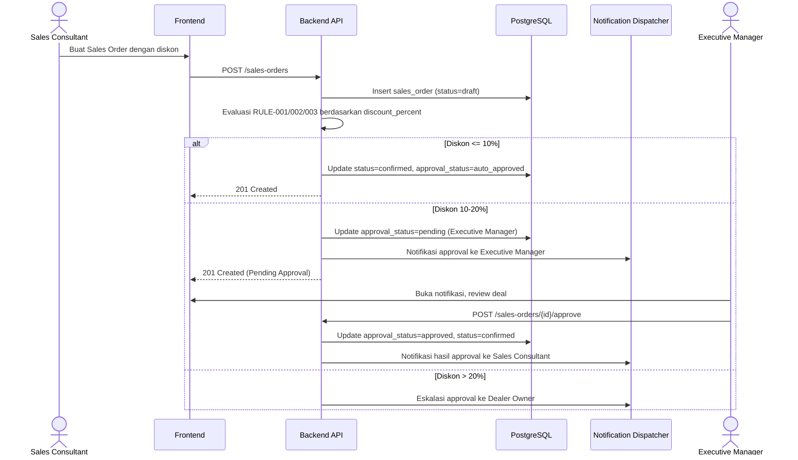
```mermaid
sequenceDiagram
    actor Sales as Sales Consultant
    participant FE as Frontend
    participant API as Backend API
    participant DB as PostgreSQL
    participant Notif as Notification Dispatcher
    actor Exec as Executive Manager

    Sales->>FE: Buat Sales Order dengan diskon
    FE->>API: POST /sales-orders
    API->>DB: Insert sales_order (status=draft)
    API->>API: Evaluasi RULE-001/002/003 berdasarkan discount_percent
    alt Diskon <= 10%
        API->>DB: Update status=confirmed, approval_status=auto_approved
        API-->>FE: 201 Created
    else Diskon 10-20%
        API->>DB: Update approval_status=pending (Executive Manager)
        API->>Notif: Notifikasi approval ke Executive Manager
        API-->>FE: 201 Created (Pending Approval)
        Exec->>FE: Buka notifikasi, review deal
        Exec->>API: POST /sales-orders/{id}/approve
        API->>DB: Update approval_status=approved, status=confirmed
        API->>Notif: Notifikasi hasil approval ke Sales Consultant
    else Diskon > 20%
        API->>Notif: Eskalasi approval ke Dealer Owner
    end
```

### 28.3 Generate AI Insight (Async Job)

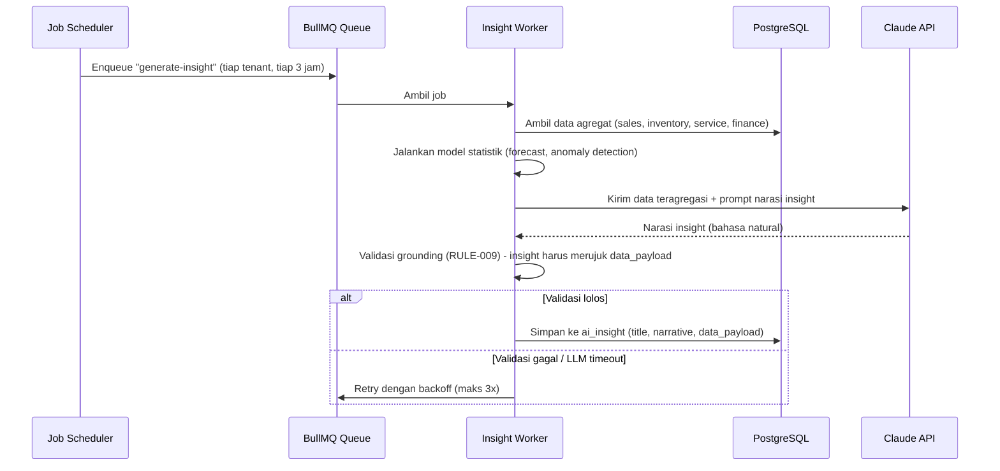
```mermaid
sequenceDiagram
    participant Scheduler as Job Scheduler
    participant Queue as BullMQ Queue
    participant Worker as Insight Worker
    participant DB as PostgreSQL
    participant LLM as Claude API

    Scheduler->>Queue: Enqueue "generate-insight" (tiap tenant, tiap 3 jam)
    Queue->>Worker: Ambil job
    Worker->>DB: Ambil data agregat (sales, inventory, service, finance)
    Worker->>Worker: Jalankan model statistik (forecast, anomaly detection)
    Worker->>LLM: Kirim data teragregasi + prompt narasi insight
    LLM-->>Worker: Narasi insight (bahasa natural)
    Worker->>Worker: Validasi grounding (RULE-009) - insight harus merujuk data_payload
    alt Validasi lolos
        Worker->>DB: Simpan ke ai_insight (title, narrative, data_payload)
    else Validasi gagal / LLM timeout
        Worker->>Queue: Retry dengan backoff (maks 3x)
    end
```

### 28.4 AI Assistant — Query Data & Buat Reminder

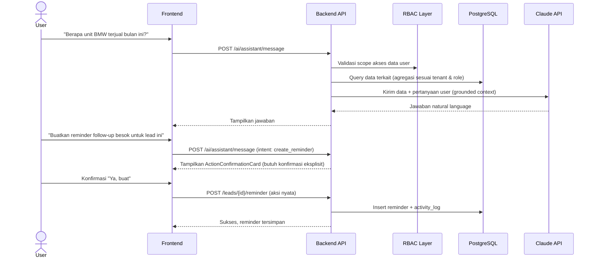
```mermaid
sequenceDiagram
    actor User
    participant FE as Frontend
    participant API as Backend API
    participant RBAC as RBAC Layer
    participant DB as PostgreSQL
    participant LLM as Claude API

    User->>FE: "Berapa unit BMW terjual bulan ini?"
    FE->>API: POST /ai/assistant/message
    API->>RBAC: Validasi scope akses data user
    API->>DB: Query data terkait (agregasi sesuai tenant & role)
    API->>LLM: Kirim data + pertanyaan user (grounded context)
    LLM-->>API: Jawaban natural language
    API-->>FE: Tampilkan jawaban
    User->>FE: "Buatkan reminder follow-up besok untuk lead ini"
    FE->>API: POST /ai/assistant/message (intent: create_reminder)
    API-->>FE: Tampilkan ActionConfirmationCard (butuh konfirmasi eksplisit)
    User->>FE: Konfirmasi "Ya, buat"
    FE->>API: POST /leads/{id}/reminder (aksi nyata)
    API->>DB: Insert reminder + activity_log
    API-->>FE: Sukses, reminder tersimpan
```

### 28.5 Update Status Pengiriman (Live Delivery Tracking)

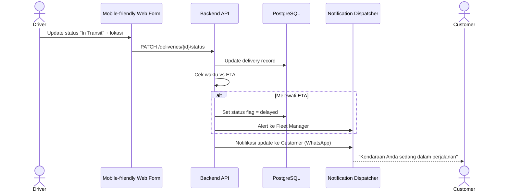
```mermaid
sequenceDiagram
    actor Driver
    participant FE as Mobile-friendly Web Form
    participant API as Backend API
    participant DB as PostgreSQL
    participant Notif as Notification Dispatcher
    actor Customer

    Driver->>FE: Update status "In Transit" + lokasi
    FE->>API: PATCH /deliveries/{id}/status
    API->>DB: Update delivery record
    API->>API: Cek waktu vs ETA
    alt Melewati ETA
        API->>DB: Set status flag = delayed
        API->>Notif: Alert ke Fleet Manager
    end
    API->>Notif: Notifikasi update ke Customer (WhatsApp)
    Notif-->>Customer: "Kendaraan Anda sedang dalam perjalanan"
```

---

## 29. Activity Diagrams

### 29.1 Proses Penjualan End-to-End (Multi-Actor)

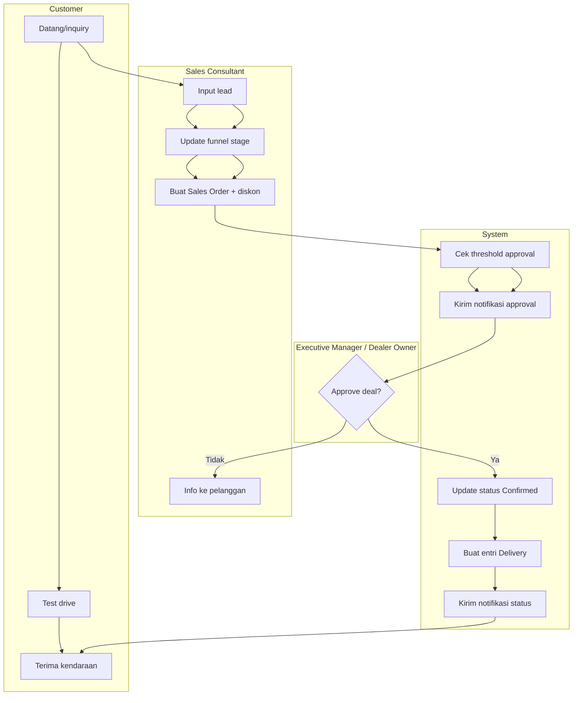
```mermaid
flowchart TD
    subgraph Customer
        A[Datang/inquiry] --> B[Test drive]
        B --> N[Terima kendaraan]
    end
    subgraph "Sales Consultant"
        C[Input lead] --> D[Update funnel stage]
        D --> E[Buat Sales Order + diskon]
        F[Info ke pelanggan]
    end
    subgraph "Executive Manager / Dealer Owner"
        G{Approve deal?}
    end
    subgraph System
        H[Cek threshold approval] --> I[Kirim notifikasi approval]
        J[Update status Confirmed]
        K[Buat entri Delivery]
        L[Kirim notifikasi status]
    end

    A --> C
    C --> D
    D --> E
    E --> H
    H --> I
    I --> G
    G -- Ya --> J
    G -- Tidak --> F
    J --> K
    K --> L
    L --> N
```

### 29.2 Proses Booking & Eksekusi Servis (Multi-Actor)

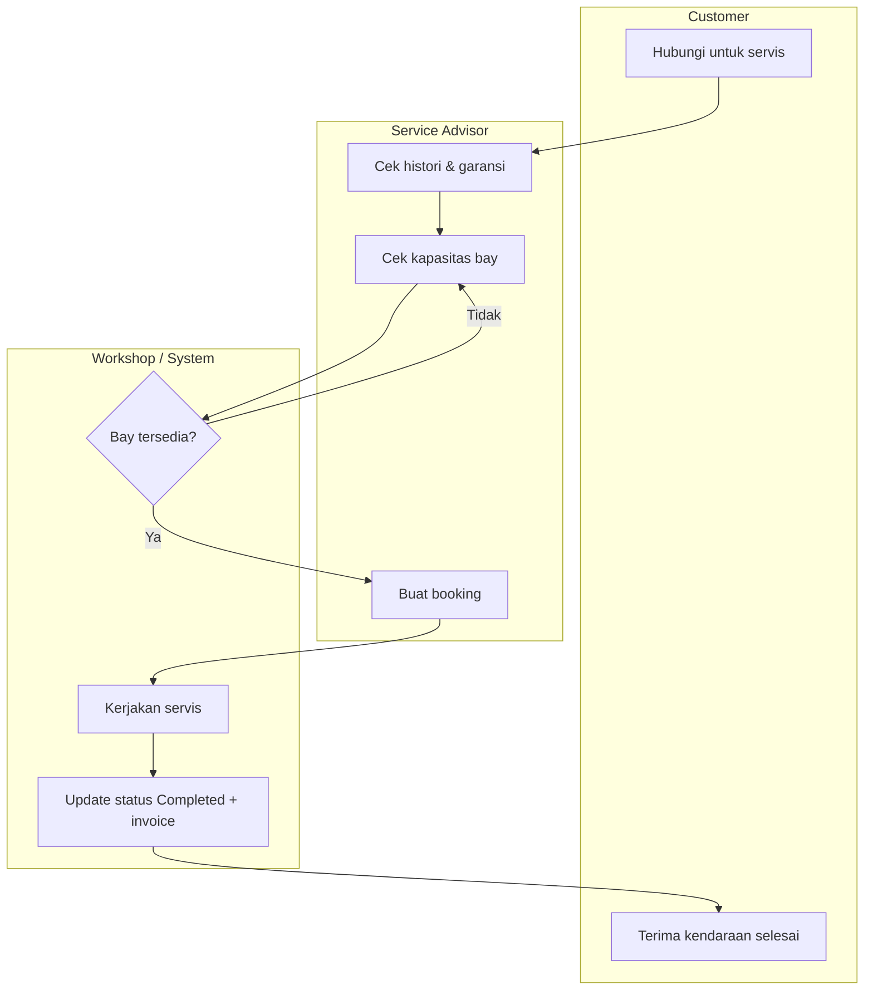
```mermaid
flowchart TD
    subgraph Customer
        A[Hubungi untuk servis]
        H[Terima kendaraan selesai]
    end
    subgraph "Service Advisor"
        B[Cek histori & garansi]
        C[Cek kapasitas bay]
        D[Buat booking]
    end
    subgraph "Workshop / System"
        E{Bay tersedia?}
        F[Kerjakan servis]
        G[Update status Completed + invoice]
    end

    A --> B --> C --> E
    E -- Tidak --> C
    E -- Ya --> D --> F --> G --> H
```

---

## 30. State Diagrams

### 30.1 Siklus Hidup Kendaraan (`vehicle.status`)

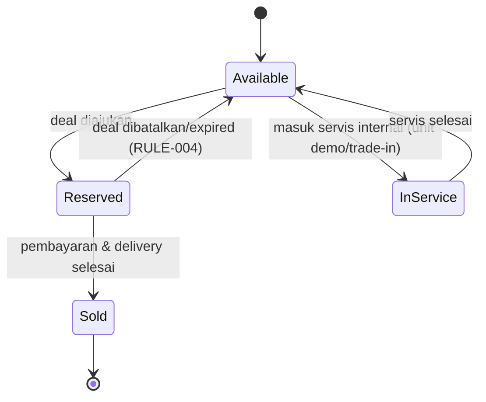
```mermaid
stateDiagram-v2
    [*] --> Available
    Available --> Reserved: deal diajukan
    Reserved --> Available: deal dibatalkan/expired (RULE-004)
    Reserved --> Sold: pembayaran & delivery selesai
    Available --> InService: masuk servis internal (unit demo/trade-in)
    InService --> Available: servis selesai
    Sold --> [*]
```

### 30.2 Siklus Hidup Sales Order (`sales_order.status`)

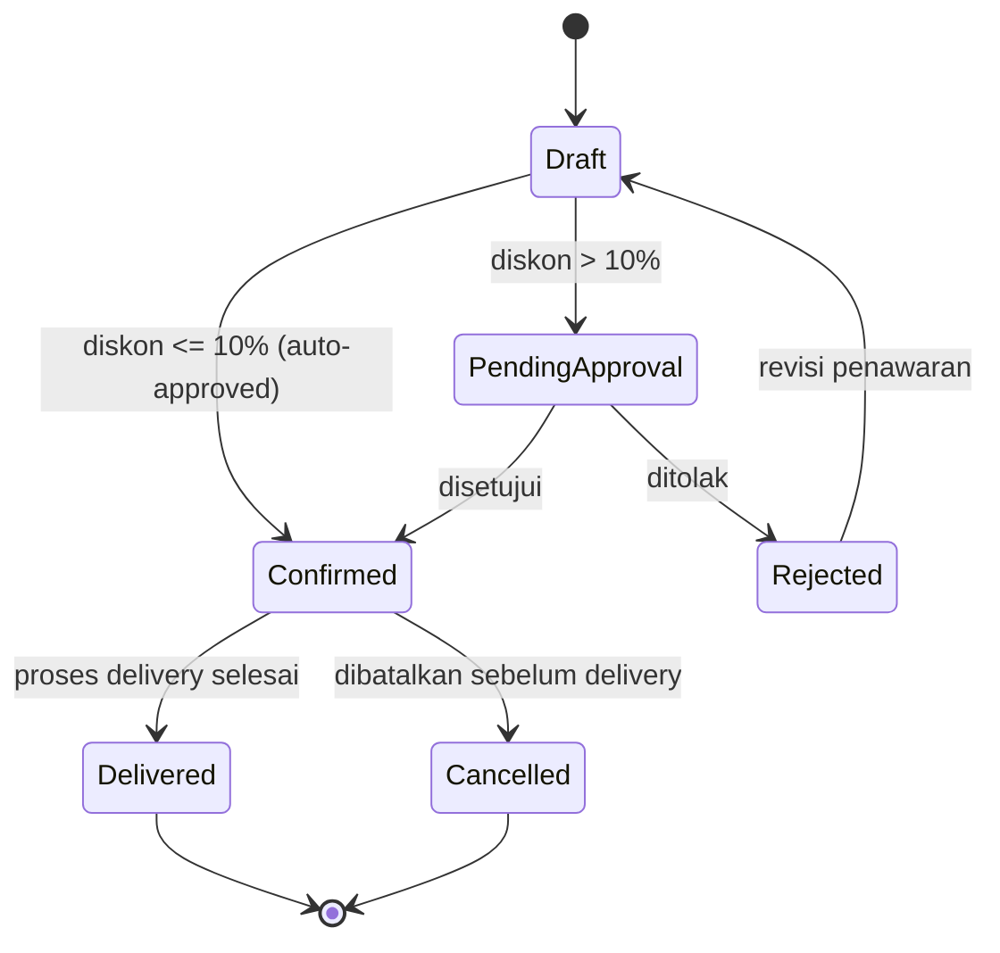
```mermaid
stateDiagram-v2
    [*] --> Draft
    Draft --> PendingApproval: diskon > 10%
    Draft --> Confirmed: diskon <= 10% (auto-approved)
    PendingApproval --> Confirmed: disetujui
    PendingApproval --> Rejected: ditolak
    Rejected --> Draft: revisi penawaran
    Confirmed --> Delivered: proses delivery selesai
    Confirmed --> Cancelled: dibatalkan sebelum delivery
    Delivered --> [*]
    Cancelled --> [*]
```

### 30.3 Siklus Hidup Service Booking (`service_booking.status`)

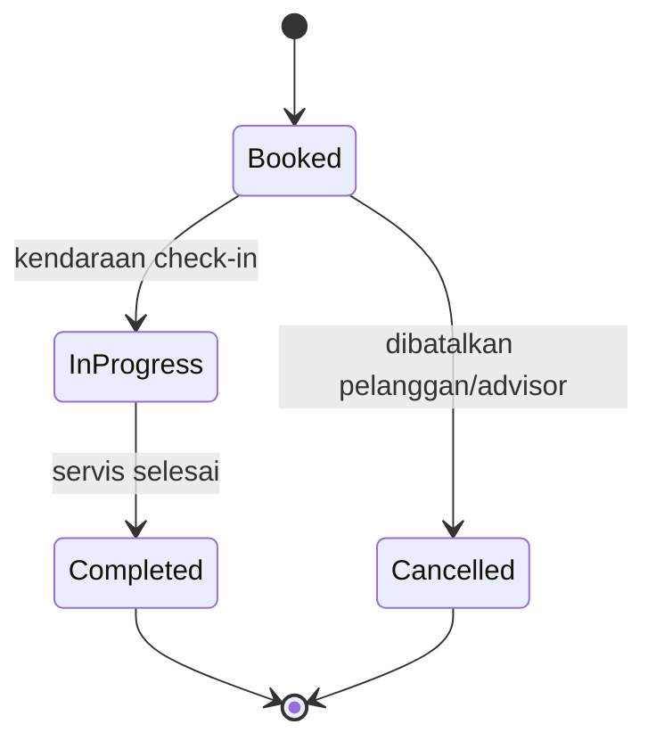
```mermaid
stateDiagram-v2
    [*] --> Booked
    Booked --> InProgress: kendaraan check-in
    InProgress --> Completed: servis selesai
    Booked --> Cancelled: dibatalkan pelanggan/advisor
    Completed --> [*]
    Cancelled --> [*]
```

### 30.4 Siklus Hidup Delivery (`delivery.status`)

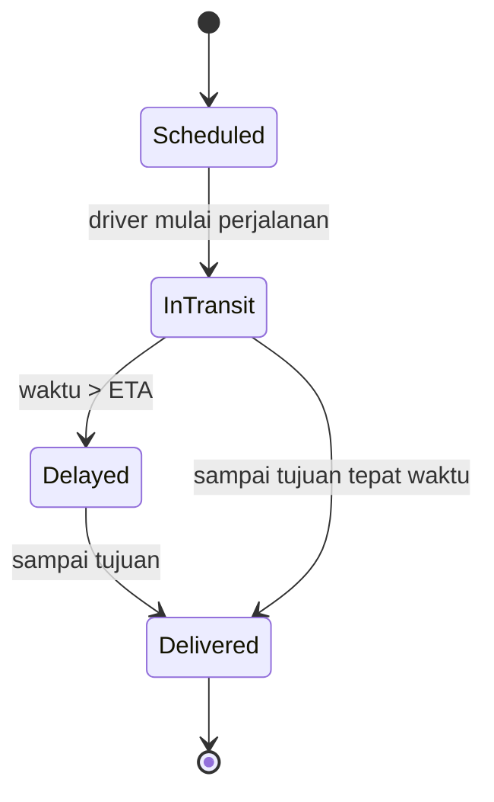
```mermaid
stateDiagram-v2
    [*] --> Scheduled
    Scheduled --> InTransit: driver mulai perjalanan
    InTransit --> Delayed: waktu > ETA
    Delayed --> Delivered: sampai tujuan
    InTransit --> Delivered: sampai tujuan tepat waktu
    Delivered --> [*]
```

---

## 31. Permission Matrix

Legend: **F** = Full Access (CRUD) · **E** = Edit terbatas (sesuai scope sendiri) · **V** = View Only · **A** = Approval Only · **–** = Tidak ada akses

| Fitur/Resource | Super Admin | Dealer Owner | Exec Manager | Sales Consultant | Inventory Mgr | Service Advisor | Fleet Manager | Finance Team | Marketing Team | System Admin |
|---|---|---|---|---|---|---|---|---|---|---|
| Executive Overview Dashboard | V | F | V | – | – | – | – | V | V | V |
| Sales Intelligence | – | V | V | E (milik sendiri) | V | – | – | V | V | V |
| Vehicle Inventory Management | – | V | V | V | F | V | V | V | V | V |
| Premium Vehicle Gallery | – | V | V | V | V | V | – | V | V | V |
| Vehicle Detail (360°) | – | V | V | V | F | V | – | V | V | V |
| Customer Analytics | – | V | V | E | – | V | – | V | F | V |
| Fleet Monitoring | – | V | V | – | – | – | F | – | – | V |
| Service Management | – | V | V | – | V | F | V | V | – | V |
| Financial Dashboard | – | F | V | – | – | – | – | F | – | V |
| Brand Performance Comparison | – | V | V | – | V | – | – | V | V | V |
| AI Insight Panel | – | F | V | V | V | V | V | V | V | V |
| Live Delivery Tracking | – | V | V | V (milik sendiri) | – | – | F | – | – | V |
| Activity Timeline | – | V | V | V | V | V | V | V | V | V |
| Notification Center | V | F | F | F | F | F | F | F | F | F |
| AI Assistant | V | F | F | F | F | F | F | F | F | F |
| Smart Search | V | F | F | F (scope RBAC) | F | F | F | F | F | F |
| Report Center | – | F | F | – | E | E | E | F | E | F |
| User & Role Management | V (lintas tenant) | E | – | – | – | – | – | – | – | F |
| Tenant & Branch Management | F | E | – | – | – | – | – | – | – | F |
| Platform Super Admin Console | F | – | – | – | – | – | – | – | – | – |
| Sales Order — Approval Diskon 10–20% | – | A | A | – | – | – | – | – | – | – |
| Sales Order — Approval Diskon >20% | – | A | – | – | – | – | – | – | – | – |

*Setiap baris di atas ditegakkan di dua lapis: UI (menyembunyikan menu/aksi yang tidak relevan) dan API middleware RBAC (menolak request meski URL diakses langsung) — lihat REQ-028.*

---

## 32. Security Requirements

| Area | Requirement |
|---|---|
| Autentikasi | JWT access token (short-lived, 15 menit) + refresh token (rotating, 30 hari); OTP 2FA wajib untuk Dealer Owner & System Administrator (RULE-012) |
| Otorisasi | RBAC ditegakkan di API middleware untuk setiap endpoint, bukan hanya UI (REQ-028); PostgreSQL Row-Level Security sebagai lapis kedua tenant isolation |
| Enkripsi | TLS 1.2+ untuk seluruh komunikasi (NFR-008); AES-256 untuk data sensitif at-rest (NFR-009); password di-hash dengan bcrypt/argon2 (never plaintext) |
| Rate Limiting | Login endpoint dibatasi 5 percobaan/15 menit per akun + per IP; API publik umum dibatasi sesuai tier subscription tenant |
| Proteksi Data Kartu Pembayaran | Tidak menyimpan data kartu mentah — seluruh transaksi kartu didelegasikan ke Payment Gateway (tokenisasi), sesuai standar PCI-DSS SAQ-A |
| Audit Trail | Setiap aksi sensitif (login, approval, perubahan role, perubahan harga, akses data pelanggan) tercatat immutable di `activity_log` |
| Proteksi Upload File | Validasi tipe MIME & ukuran file di server (bukan hanya client), scanning malware pada file yang diunggah (foto/dokumen), URL media disajikan via signed URL bertenggat waktu |
| Session Management | Idle timeout 30 menit, force logout saat password diganti atau user dinonaktifkan (RULE-014) |
| Kepatuhan Data | Mengacu UU PDP Indonesia — data pelanggan (PII) hanya diakses role yang berwenang, mendukung permintaan hapus data pelanggan (right to erasure) |
| Keamanan AI | Prompt ke LLM API tidak menyertakan data PII yang tidak perlu; output AI Assistant/Insight tidak boleh membocorkan data tenant lain (isolasi konteks per-request berbasis tenant_id) |
| Penetration Testing | Pen-test tahunan minimum + vulnerability scanning otomatis (SAST/DAST) di setiap rilis mayor *(Assumption — jadwal disesuaikan saat build)* |

## 33. Logging Strategy

- **Structured logging (JSON)** di seluruh service backend, dengan `correlation_id`/`trace_id` per request (NFR-016) agar dapat ditelusuri lintas service (API → Worker → LLM call).
- **Level log:** `ERROR` (kegagalan sistem), `WARN` (kondisi tidak normal tapi ter-handle, misal retry job), `INFO` (event bisnis penting: login, approval, deal confirmed), `DEBUG` (hanya aktif di environment non-produksi).
- **Audit log (`activity_log`) bersifat append-only/immutable** — tidak dapat diedit/dihapus oleh user manapun termasuk System Administrator, hanya dapat di-query.
- **Redaksi PII** — log operasional (bukan audit) tidak boleh menampilkan password, token, nomor kartu, atau data pelanggan mentah; gunakan masking (`***`) untuk field sensitif.
- **Retensi:** log operasional 12 bulan, audit log 5 tahun *(Assumption — sesuaikan dengan kebijakan compliance final)*.
- **Sentralisasi:** direkomendasikan agregasi log via Grafana Loki/ELK (lihat Appendix A) agar dapat di-query lintas service dari satu tempat.

---

## 34. Notification Flow

| Event | Channel | Recipient Role | Ringkasan Konten |
|---|---|---|---|
| Lead baru ditugaskan | In-App, Email | Sales Consultant terkait | "Lead baru dari [sumber] telah ditugaskan ke Anda" |
| Deal butuh approval (10–20%) | In-App, WhatsApp | Executive Manager | "Deal #[ID] menunggu persetujuan Anda — diskon [X]%" |
| Deal butuh approval (>20%) | In-App, WhatsApp, Email | Dealer Owner | Sama seperti di atas, eskalasi |
| Deal disetujui/ditolak | In-App | Sales Consultant pengaju | "Deal #[ID] telah [disetujui/ditolak]" |
| Stok kendaraan low-stock | In-App, Email | Inventory Manager, Dealer Owner | "Stok [model] tersisa [n] unit" |
| Kendaraan reserved akan expired | In-App | Sales Consultant terkait | "Reservasi kendaraan [VIN] akan berakhir dalam [X] jam" |
| Booking servis dikonfirmasi | In-App, WhatsApp, Email | Pelanggan (eksternal), Service Advisor | "Servis Anda dijadwalkan pada [tanggal/jam]" |
| Servis selesai | In-App, WhatsApp | Pelanggan (eksternal) | "Kendaraan Anda siap diambil" |
| Pengingat servis berkala/garansi jatuh tempo | WhatsApp, Email | Pelanggan (eksternal) | "Saatnya servis berkala untuk kendaraan Anda" |
| Status pengiriman berubah | In-App, WhatsApp | Fleet Manager, Pelanggan | "Kendaraan Anda [status]" |
| Pengiriman terlambat dari ETA | In-App, Web Push | Fleet Manager | "Pengiriman #[ID] melewati ETA" |
| Kendaraan fleet idle > threshold | In-App | Fleet Manager | "Kendaraan [ID] idle selama [X] jam" |
| Insight AI baru tersedia (digest) | In-App, Email (mingguan) | Dealer Owner, Executive Manager | Ringkasan insight prioritas tinggi minggu ini |
| Laporan siap diunduh | In-App, Email | Requester | "Laporan [jenis] Anda siap diunduh" |
| User baru diundang | Email | User yang diundang | Tautan aktivasi akun |
| Percobaan login gagal berulang / login dari device baru | Email | User terkait | Peringatan keamanan |
| Tenant mendekati/melewati grace period billing | In-App, Email | Dealer Owner | Peringatan pembatasan akses |

*Preferensi channel notifikasi (kecuali notifikasi keamanan kritikal) dapat dikustomisasi per user di Profile & App Settings (SCR-026).*

---

## 35. Integration Requirements

| Integrasi | Tujuan | Arah | Metode Auth | Related FEAT |
|---|---|---|---|---|
| Payment Gateway (Midtrans/Xendit) | Proses DP/pembayaran kendaraan | Outbound + Webhook inbound | API Key + HMAC signature webhook | FEAT-002, 009 |
| Google Maps API | Peta Fleet Monitoring & Live Delivery Tracking | Outbound | API Key | FEAT-007, 012 |
| WhatsApp Business API | Notifikasi ke pelanggan & internal | Outbound (+ webhook status delivery) | OAuth/API Key via BSP resmi | FEAT-014, 008, 012 |
| Email Provider (SendGrid/Resend) | Notifikasi transaksional & laporan terjadwal | Outbound | API Key | FEAT-014, 017, 019 |
| Anthropic Claude API (LLM) | AI Insight Panel & AI Assistant | Outbound | API Key | FEAT-011, 015 |
| Object Storage (S3/Cloudflare R2) | Penyimpanan media kendaraan & file laporan | Outbound | Signed URL / IAM Role | FEAT-003, 005, 017 |
| Google SSO (OAuth2) | Login alternatif | Inbound (redirect flow) | OAuth2/OIDC | FEAT-019 |
| *(Future)* ERP/CRM eksternal | Sinkronisasi data pelanggan/keuangan | Bidirectional | Sesuai sistem tujuan | Out of Scope MVP |
| *(Future)* GPS/Telematics Provider | Lokasi real-time hardware kendaraan | Inbound | Sesuai vendor | Out of Scope MVP (FEAT-007, 012 lanjutan) |

---

## 36. AI Features Recommendation

Sesuai keputusan Phase 2 (hybrid approach), berikut rekomendasi detail implementasi kecerdasan buatan di DriveOS:

| Kapabilitas | Pendekatan | Rasional |
|---|---|---|
| **Demand Forecasting** (prediksi permintaan model/brand) | Model statistik time-series (moving average / regresi) dijalankan di backend worker | Lebih murah, cepat, dan deterministik dibanding LLM untuk perhitungan numerik berulang |
| **Anomaly Detection** (penurunan penjualan mendadak, lonjakan biaya servis) | Rule-based threshold + statistical z-score pada job berkala | Konsisten, dapat diaudit, tidak "hallucinate" |
| **Narrative Insight Generation** (AI Insight Panel) | Claude API menerjemahkan hasil agregat/statistik menjadi narasi bahasa natural | LLM unggul dalam komunikasi manusiawi, bukan komputasi numerik mentah — data mentah tetap dari engine statistik (RULE-009) |
| **AI Assistant Q&A** | Claude API dengan konteks data teragregasi (RAG-style: query DB dulu, baru kirim hasil ke LLM sebagai grounding) | Mencegah LLM mengarang angka; jawaban selalu bersumber dari query real-time |
| **Aksi Terbatas via AI Assistant** (buat reminder, trigger report) | Intent classification → konfirmasi eksplisit user → eksekusi via endpoint REST reguler (bukan LLM langsung menulis DB) | Menjaga integritas data & auditability (RULE-010) |
| **Rekomendasi Harga/Diskon** *(Future)* | Model ML terpisah (di luar MVP) | Membutuhkan data historis matang sebelum layak diproduksi |

**Prinsip tata kelola AI (AI Governance):**
1. Tidak ada aksi finansial/approval yang dieksekusi otonom oleh AI (RULE-010).
2. Setiap insight/jawaban AI wajib dapat ditelusuri ke data sumber (RULE-009, "no hallucination policy").
3. Seluruh interaksi AI Assistant tercatat di `activity_log` untuk audit.
4. User selalu dapat melihat disclaimer "Insight ini digenerate otomatis, verifikasi sebelum keputusan besar" pada AI Insight Panel.

---

## 37. Analytics & Event Tracking Plan

| Event Name | Trigger | Properti Utama | Tujuan Analisis |
|---|---|---|---|
| `user_login` | Login berhasil | `role, tenant_id, method (password/sso)` | Adopsi & pola login |
| `dashboard_viewed` | Halaman dashboard dimuat | `screen_id, period_filter` | Halaman paling sering diakses |
| `kpi_card_clicked` | Klik KPI card drill-down | `kpi_name` | Minat eksekutif terhadap metrik tertentu |
| `lead_stage_changed` | Update stage funnel | `from_stage, to_stage, lead_id` | Analisis bottleneck funnel |
| `vehicle_360_viewed` | Buka viewer 360° | `vehicle_id, duration_seconds` | Engagement showcase kendaraan |
| `sales_order_created` | Deal dibuat | `discount_percent, approval_required` | Pola diskon & approval |
| `ai_insight_action_clicked` | Klik "Ambil Tindakan" di insight | `insight_id, category` | Efektivitas AI Insight |
| `ai_assistant_query_sent` | User kirim pesan ke AI Assistant | `query_length, intent_detected` | Adopsi & pola pertanyaan AI Assistant |
| `report_generated` | Laporan berhasil dibuat | `report_type, format` | Fitur pelaporan yang paling dipakai |
| `notification_clicked` | Klik notifikasi | `notification_type` | Efektivitas notifikasi |
| `search_performed` | Query Smart Search dikirim | `query_length, result_count, category_clicked` | Kualitas hasil pencarian |
| `theme_changed` | User ganti tema | `from_theme, to_theme` | Preferensi tampilan |

*Seluruh event terkirim ke layer analitik produk internal (contoh: PostHog — lihat Appendix A) dan tidak menyertakan PII mentah (gunakan `user_id`/`tenant_id` sebagai referensi, bukan nama/email langsung).*

---

## 38. Accessibility (WCAG 2.2 Level AA)

| Kriteria | Implementasi di DriveOS |
|---|---|
| 1.4.3 Kontras Minimum | Rasio kontras teks-background ≥ 4.5:1 (body text), ≥ 3:1 (teks besar/headline) di kedua tema |
| 1.4.4 Resize Text / Dynamic Type | Layout menggunakan `rem`, mendukung perbesaran teks hingga 200% tanpa kehilangan konten/fungsi |
| 2.1.1 Keyboard Accessible | Seluruh interaksi (termasuk 360° viewer, drag funnel board) memiliki alternatif keyboard (panah, Tab, Enter) |
| 2.4.7 Focus Visible | Focus ring jelas pada seluruh elemen interaktif (tidak dihilangkan via CSS) |
| 2.4.11 Focus Not Obscured *(WCAG 2.2 baru)* | Elemen fokus tidak tertutup oleh navigasi sticky/frosted glass |
| 2.5.7 Dragging Movements *(WCAG 2.2 baru)* | Fitur drag (Sales Funnel board) menyediakan alternatif non-drag (dropdown status) |
| 2.5.8 Target Size *(WCAG 2.2 baru)* | Target tap minimal 24x24px (button umum ≥44x44px sesuai HIG) |
| 3.3.7 Redundant Entry *(WCAG 2.2 baru)* | Form multi-step (booking servis, tambah kendaraan) tidak meminta ulang data yang sudah diisi di step sebelumnya |
| 4.1.2 Name, Role, Value | Seluruh komponen custom (chip, badge, chart) memiliki ARIA label yang sesuai |
| Non-color reliance | Status (badge, KPI trend) selalu disertai ikon/teks, tidak hanya warna |
| Screen reader untuk chart (ECharts) | Setiap chart menyediakan tabel data alternatif tersembunyi (`sr-only`) yang dapat dibaca screen reader |

---

## 39. Performance Requirements

| Area | Target |
|---|---|
| First Contentful Paint (FCP) | ≤ 1.8 detik |
| Largest Contentful Paint (LCP) | ≤ 2.5 detik (NFR-002) |
| Time to Interactive (TTI) | ≤ 2.5 detik (NFR-001) |
| Cumulative Layout Shift (CLS) | ≤ 0.1 |
| API p95 response time (read) | ≤ 300ms (NFR-003) |
| API p95 response time (write/transaksional) | ≤ 600ms |
| 360° Viewer — waktu render awal | ≤ 1.5 detik untuk 24 frame (progressive loading, prioritaskan frame depan) |
| Bundle size initial load (JS, gzip) | ≤ 250KB untuk shell aplikasi (code-splitting per route wajib) |
| Database query kompleks (dashboard aggregation) | ≤ 500ms melalui materialized view/cache Redis (TTL 5–15 menit sesuai kekritisan data) |
| Concurrent users tanpa degradasi | ≥ 500 (NFR-005), dengan horizontal scaling API & worker |

---

## 40. Technical Constraints

- Frontend wajib Next.js/React/TypeScript/Tailwind/shadcn/ui/Framer Motion/Three.js + React Three Fiber/React Query/Zustand/Apache ECharts sesuai keputusan stakeholder — tidak ada substitusi tanpa persetujuan ulang.
- Backend wajib NestJS + PostgreSQL + Redis + REST API — tidak menggunakan GraphQL di MVP (dapat dievaluasi di roadmap jika kebutuhan query kompleks meningkat).
- SF Pro Display/SF Symbols adalah properti Apple dan tidak memiliki lisensi web publik resmi — implementasi menggunakan font fallback yang secara visual setara (`-apple-system` stack + Inter) dan ikon `lucide-react` sebagai pengganti SF Symbols; ini adalah **batasan teknis-legal**, bukan pilihan estetika.
- Fitur 360° Viewer & AI Assistant memerlukan device dengan dukungan WebGL & koneksi internet stabil — perlu fallback untuk device/browser lama (§18, §23.3).
- Live Delivery Tracking & Fleet Monitoring tahap MVP bergantung pada update manual/berkala (bukan hardware GPS real-time) — akurasi lokasi terbatas pada frekuensi update yang dilakukan driver/sistem (Assumption di Phase 2).
- Ketergantungan pada pihak ketiga (Payment Gateway, WhatsApp Business API, Google Maps, Claude API) berarti SLA DriveOS untuk fitur terkait tidak bisa melebihi SLA provider tersebut.

---

## 41. QA Strategy

### 41.1 Test Approach

- **Unit Test:** Setiap service/module backend (NestJS) dan komponen React kritikal — target coverage ≥70% (NFR-012), menggunakan Jest/Vitest + Testing Library.
- **Integration Test:** Menguji interaksi API ↔ Database ↔ Cache/Queue, khususnya alur approval diskon, reservasi kendaraan (race condition), dan job async AI Insight/Report.
- **End-to-End (E2E) Test:** Playwright mencakup jalur kritikal — login+OTP, buat deal end-to-end, booking servis, generate laporan, AI Assistant Q&A dasar.
- **Performance Test:** Load testing (k6/Artillery) untuk skenario 500 concurrent users pada Executive Overview Dashboard & API pencarian.
- **Security Test:** SAST/DAST otomatis di CI/CD + pengujian RBAC (memastikan role X tidak bisa mengakses endpoint role Y) sebagai bagian wajib regression suite.
- **Accessibility Test:** Automated (axe-core) + manual screen reader testing (VoiceOver/NVDA) pada halaman kritikal sebelum setiap rilis mayor.
- **Visual Regression:** Snapshot testing komponen design system (Chromatic/Percy) untuk menjaga konsistensi Apple Design System di light & dark mode.

### 41.2 Acceptance Criteria Summary

Seluruh AC-### telah didefinisikan per User Story pada §12 dalam format Given/When/Then dan menjadi basis penulisan test case E2E/integration.

### 41.3 Traceability Matrix (contoh)

| REQ/US ID | Skenario Uji | Status |
|---|---|---|
| US-001 / AC-001-1 | Executive Dashboard menampilkan 5 KPI dengan data ≤15 menit | Belum diuji |
| US-004 / AC-004-2 | Insight AI menampilkan data pendukung yang valid, bukan klaim kosong | Belum diuji |
| US-009 / AC-009-2 | Duplikasi VIN ditolak sistem | Belum diuji |
| US-011 / AC-011-1 | Booking servis melebihi kapasitas bay ditolak & disarankan slot alternatif | Belum diuji |
| US-015 / AC-015-3 | AI Assistant menolak permintaan approval diskon otonom | Belum diuji |
| US-019 / AC-019-2 | Akun terkunci setelah 5x percobaan login gagal | Belum diuji |

*Tabel ini menjadi living document yang diperbarui tim QA seiring progres sprint — status berubah menjadi Passed/Failed/Blocked.*

---

## 42. Risk Analysis

| RISK ID | Risiko | Likelihood | Impact | Mitigasi |
|---|---|---|---|---|
| RISK-001 | Kebocoran data antar tenant akibat kesalahan implementasi RLS/filter query | Rendah | Sangat Tinggi | Wajib `tenant_id` di setiap tabel & query; automated test isolasi data di setiap PR; PostgreSQL RLS sebagai lapis kedua (§27, §32) |
| RISK-002 | Biaya & latensi tinggi akibat pemanggilan LLM API real-time berlebihan | Sedang | Sedang | Insight digenerate async & di-cache per interval (§28.3); AI Assistant dibatasi rate-limit per user/hari |
| RISK-003 | LLM menghasilkan insight/jawaban tidak akurat ("hallucination") | Sedang | Tinggi | RULE-009 grounding wajib; validasi data_payload sebelum publikasi; disclaimer di UI (§36) |
| RISK-004 | Performa buruk pada 360° Viewer (Three.js/R3F) di device low-end | Sedang | Sedang | Lazy-loading, kompresi tekstur, fallback galeri 2D otomatis saat WebGL tidak didukung |
| RISK-005 | Keterlambatan approval integrasi WhatsApp Business API & Payment Gateway (proses verifikasi bisnis pihak ketiga) | Tinggi | Sedang | Ajukan proses verifikasi di awal fase development, bukan menjelang rilis; siapkan fallback Email selama proses berjalan |
| RISK-006 | Ekspektasi "real-time" pada Fleet Monitoring/Live Delivery Tracking tidak terpenuhi tanpa hardware GPS | Tinggi | Sedang | Komunikasikan batasan MVP (update manual/berkala) secara eksplisit ke stakeholder & end-user sejak awal; GPS/telematics masuk roadmap |
| RISK-007 | Konflik data akibat reservasi kendaraan ganda (race condition) | Sedang | Sedang | Optimistic locking + unique constraint status di level database (§18) |
| RISK-008 | Skala data tumbuh cepat (multi-tenant) menyebabkan query dashboard melambat | Sedang | Tinggi | Materialized view, index composite, caching Redis, monitoring query lambat sejak dini |
| RISK-009 | Ketergantungan pada satu penyedia LLM (Anthropic) — perubahan harga/kebijakan API | Rendah | Sedang | Abstraksi layer AI service agar mudah beralih provider bila diperlukan di masa depan |
| RISK-010 | Adopsi pengguna rendah karena kompleksitas fitur AI dianggap "gimmick" oleh user non-teknis | Sedang | Sedang | Onboarding contextual tooltip, quick-prompt suggestions AI Assistant, iterasi berbasis event tracking (§37) |
| RISK-011 | Font SF Pro/SF Symbols tidak dapat digunakan resmi di web (batasan lisensi Apple) | Tinggi (pasti terjadi) | Rendah | Gunakan fallback font/ikon setara secara visual sejak awal desain (§40), komunikasikan ke stakeholder bahwa ini bukan replika 1:1 produk Apple |

---

## 43. Release Plan

*(Fase berbasis milestone fungsional, bukan tanggal pasti — sesuai asumsi timeline fleksibel Phase 2.)*

| Fase | Cakupan | Estimasi Durasi |
|---|---|---|
| **Fase 0 — Foundation** | Setup arsitektur multi-tenant, Authentication & Security (FEAT-019), Tenant & Branch Management (FEAT-020), Apple Design System base (tokens, komponen inti) | 3–4 minggu |
| **Fase 1 — MVP Core** | Executive Overview Dashboard, Vehicle Inventory Management, Premium Vehicle Gallery, Vehicle Detail 360°, Sales Intelligence, Customer Analytics, User & Role Management, Notification Center (In-App + Email), Export CSV/PDF dasar | 8–10 minggu |
| **Fase 2 — Operasional Lanjutan** | Service Management, Financial Dashboard, Brand Performance Comparison, Report Center penuh (Excel + jadwal), integrasi WhatsApp Business API & Payment Gateway | 6–8 minggu |
| **Fase 3 — Intelligence & Fleet** | AI Insight Panel, AI Assistant, Fleet Monitoring, Live Delivery Tracking, Smart Search, Activity Timeline | 6–8 minggu |
| **Fase 4 — Platform Scale** | Platform Super Admin Console, billing/subscription tenant, hardening keamanan (pen-test), optimasi performa skala besar | 4–6 minggu |
| **Pasca-Launch** | Monitoring adopsi, iterasi berdasarkan analytics (§37), eksplorasi Future Roadmap | Berkelanjutan |

---

## 44. Future Roadmap

- **Integrasi GPS/Telematics real-time** untuk Fleet Monitoring & Live Delivery Tracking presisi tinggi (menggantikan update manual).
- **Aplikasi mobile native** (React Native) untuk Sales Consultant & Fleet Manager yang bekerja di lapangan.
- **Predictive Maintenance** berbasis data sensor IoT kendaraan (khusus fleet/rental dengan hardware pendukung).
- **Dynamic Pricing Engine** — rekomendasi harga otomatis berbasis ML (setelah data historis cukup matang).
- **Marketplace antar-dealer** — transfer stok kendaraan lintas tenant/cabang dalam jaringan DriveOS.
- **Customer-facing Self-Service Portal** — pelanggan dapat booking servis, cek status pengiriman, dan riwayat kendaraan sendiri.
- **Integrasi ERP/CRM eksternal** (SAP, Salesforce, dsb.) untuk enterprise tenant.
- **Voice Interface untuk AI Assistant** (query suara, sesuai gaya interaksi premium/hands-free di showroom).
- **EV Charging Station Monitoring** — relevan untuk tenant yang menjual kendaraan listrik (inspirasi Tesla).
- **Gamification Sales Leaderboard** — mendorong engagement tim sales melalui pencapaian & ranking.
- **White-label penuh** — kustomisasi branding menyeluruh per tenant untuk model bisnis reseller/partner.

---

## 45. Glossary

| Istilah | Definisi |
|---|---|
| **Tenant** | Satu entitas bisnis (dealer/showroom/rental) yang menggunakan DriveOS secara terisolasi dari tenant lain |
| **Branch** | Cabang/showroom fisik di bawah satu tenant |
| **Lead** | Calon pembeli yang masuk ke pipeline penjualan sebelum menjadi deal |
| **Sales Order / Deal** | Transaksi penjualan kendaraan yang sedang/sudah diproses |
| **RBAC** | Role-Based Access Control — model otorisasi berbasis peran pengguna |
| **RLS** | Row-Level Security — mekanisme PostgreSQL untuk membatasi akses baris data per kondisi (misal tenant_id) |
| **MFA/OTP 2FA** | Multi-Factor Authentication / One-Time Password sebagai lapis keamanan tambahan login |
| **VIN** | Vehicle Identification Number — nomor identitas unik kendaraan (17 karakter) |
| **MoSCoW** | Metode prioritas requirement: Must, Should, Could, Won't have |
| **Bay (Service Bay)** | Slot/stasiun kerja fisik di bengkel untuk mengerjakan satu kendaraan pada satu waktu |
| **Glassmorphism** | Gaya visual UI dengan efek kaca buram (blur + transparansi) untuk elemen navigasi/overlay |
| **Grounding (AI)** | Prinsip memastikan jawaban/insight AI selalu bersumber dari data nyata, bukan hasil karangan model |
| **WCAG** | Web Content Accessibility Guidelines — standar aksesibilitas web internasional |
| **ERD** | Entity Relationship Diagram — diagram hubungan antar entitas data |
| **SaaS Multi-Tenant** | Model arsitektur di mana satu instance aplikasi melayani banyak pelanggan/organisasi berbeda dengan data terisolasi |

---

## Appendix A: Recommended Tech Stack Tambahan

*Melengkapi stack yang telah ditentukan stakeholder (Next.js/React/TS/Tailwind/shadcn/ui/Framer Motion/Three.js/R3F/React Query/Zustand/ECharts di frontend; NestJS/PostgreSQL/Redis/REST di backend) untuk area yang belum disebutkan:*

| Layer | Rekomendasi | Alasan |
|---|---|---|
| Hosting Frontend | Vercel (region terdekat/Jakarta via edge) | Native support Next.js, deployment cepat, preview per PR |
| Hosting Backend | AWS (ap-southeast-1/Jakarta local zone) — ECS/Fargate | Kontrol penuh, mendekati lokasi user Indonesia, matang untuk compliance |
| Message Queue | BullMQ (di atas Redis yang sudah ada di stack) | Sinergi dengan Redis, ringan, cocok untuk job async AI Insight & Report |
| Object Storage | Amazon S3 atau Cloudflare R2 | Murah, andal, mendukung signed URL untuk media kendaraan |
| Autentikasi Tambahan | Custom JWT (NestJS Passport) + Google OAuth2 | Kontrol penuh atas RBAC kompleks multi-tenant, tanpa vendor lock-in |
| Payment Gateway | Midtrans atau Xendit | Dominan & teruji di pasar Indonesia, mendukung berbagai metode pembayaran lokal |
| WhatsApp Business API | Provider BSP resmi (Mekari Qontak/Twilio) | Kepatuhan kebijakan Meta, dukungan template message |
| Email Transaksional | Resend atau SendGrid | Deliverability tinggi, mudah diintegrasikan dengan NestJS |
| LLM Provider | Anthropic Claude API | Sesuai keputusan Phase 2 untuk AI Insight & AI Assistant |
| Testing Unit/Integration | Jest/Vitest + Supertest (NestJS) | Standar ekosistem TypeScript/Node |
| Testing E2E | Playwright | Dukungan multi-browser, stabil untuk skenario kompleks (drag funnel, upload media) |
| CI/CD | GitHub Actions | Terintegrasi baik dengan ekosistem Next.js/NestJS, mudah dikonfigurasi multi-environment |
| Error Tracking | Sentry | Dukungan penuh Next.js & NestJS, source map otomatis |
| Infra/Uptime Monitoring | Grafana + Prometheus | Self-hosted-friendly, fleksibel untuk arsitektur multi-tenant |
| Product Analytics | PostHog | Mendukung event tracking custom (§37) dengan opsi self-hosted untuk kontrol data |
| CDN | Cloudflare | Mempercepat delivery media kendaraan (foto/360°) & mitigasi DDoS |

---

## Appendix B: Assumptions Log

Seluruh asumsi yang dibuat sepanjang dokumen ini, dikumpulkan untuk memudahkan review stakeholder:

1. DriveOS menggantikan sepenuhnya brief "AutoVista" sebelumnya sebagai satu-satunya produk yang dikembangkan.
2. Arsitektur **multi-tenant SaaS** hierarkis (Tenant → Branch → User) dipilih agar mendukung baik model 1 perusahaan besar maupun banyak dealer berbeda dalam satu platform.
3. Autentikasi: Email/Password + Google SSO + OTP 2FA wajib untuk Dealer Owner & System Administrator.
4. Channel notifikasi utama: In-App, Email, WhatsApp Business API, Web Push; SMS hanya fallback OTP.
5. **AI Assistant** berkemampuan Q&A data-aware + aksi ringan terbatas (reminder, trigger report) dengan konfirmasi eksplisit user — tidak berwenang eksekusi aksi finansial/approval otonom.
6. **Default tema** mengikuti preferensi sistem operasi user secara otomatis, dengan override manual tersimpan per user.
7. Ditambahkan 2 role teknis di luar 8 persona asli brief: **System Administrator** (pengelola user/role/tenant) dan **Platform Super Admin** (operator SaaS internal lintas tenant).
8. **AI Insight & AI Assistant** menggunakan pendekatan hybrid: model statistik internal untuk forecasting/anomaly detection + Claude API untuk narasi bahasa natural, dengan prinsip "no hallucination" (insight wajib grounded pada data nyata).
9. Integrasi pihak ketiga MVP: Payment Gateway (Midtrans/Xendit), Google Maps API, WhatsApp Business API, Email provider transaksional, Claude API. Integrasi ERP/CRM eksternal di luar scope MVP.
10. **Live Delivery Tracking** & **Fleet Monitoring** tahap MVP berbasis update status manual/berkala (bukan GPS hardware real-time); integrasi GPS/telematics masuk Future Roadmap.
11. **Vehicle Detail 360° Viewer** menggunakan sequence gambar 360° yang diunggah admin (React Three Fiber untuk render interaktif), bukan real-time render dari file CAD.
12. Business rules approval diskon berjenjang: ≤10% auto-approved, 10–20% approval Executive Manager, >20% approval Dealer Owner (dapat dikonfigurasi per tenant di rilis mendatang).
13. Threshold operasional default (dapat dikonfigurasi per tenant): low-stock 3 unit, hold reservasi kendaraan 48 jam, idle fleet alert 48 jam, follow-up lead 7 hari, eskalasi notifikasi kritikal 30 menit.
14. Skala awal: 5–20 tenant, 1–10 cabang/tenant, ~50–500 concurrent user saat launch, dirancang scalable ke ribuan user.
15. Kepatuhan data mengacu **UU PDP Indonesia**; tidak menyimpan data kartu pembayaran mentah (didelegasikan ke payment gateway).
16. Target aksesibilitas **WCAG 2.2 Level AA** dengan dukungan Dynamic Type.
17. Timeline pengembangan fleksibel tanpa deadline eksternal keras; estimasi fase pada §43 bersifat indikatif.
18. Font SF Pro Display/SF Symbols tidak memiliki lisensi web publik resmi — diimplementasikan menggunakan font/ikon fallback yang setara secara visual (`-apple-system`/Inter + `lucide-react`).
19. Mobile native app, integrasi GPS/telematics hardware, ERP/CRM eksternal, marketplace antar-dealer, dynamic pricing engine, dan white-label penuh dinyatakan **Out of Scope** untuk rilis 1.0 (§8.2) dan masuk Future Roadmap (§44).

---

*Dokumen ini adalah living document — setiap perubahan scope, asumsi, atau prioritas wajib diperbarui di sini agar tetap menjadi single source of truth bagi seluruh tim.*
